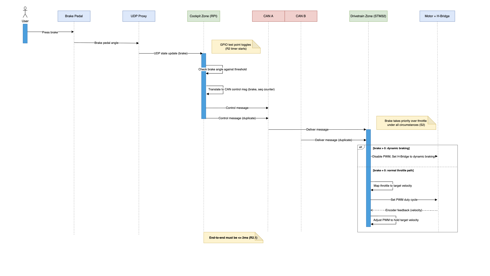
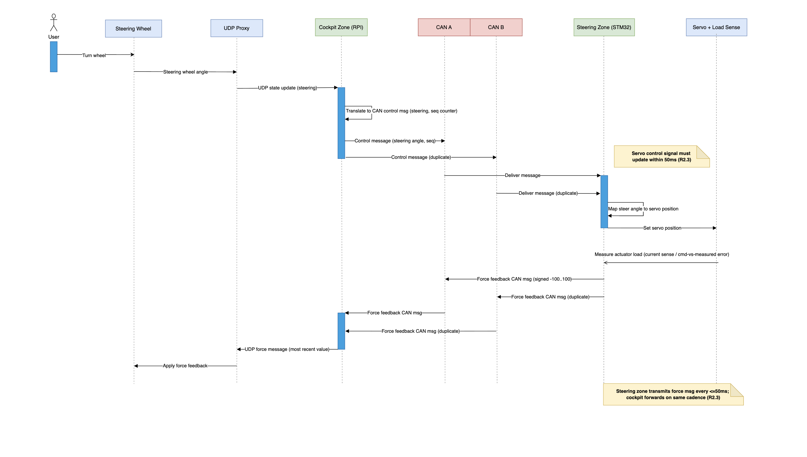
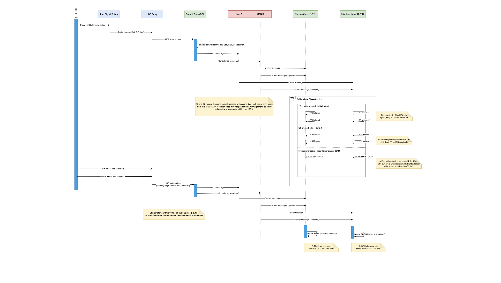
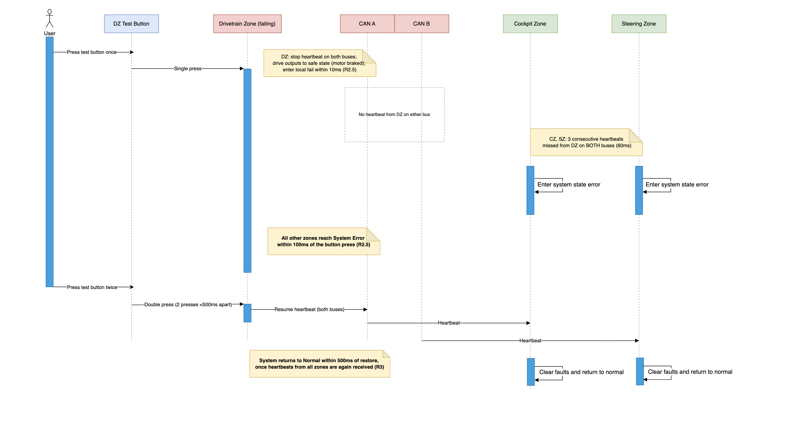
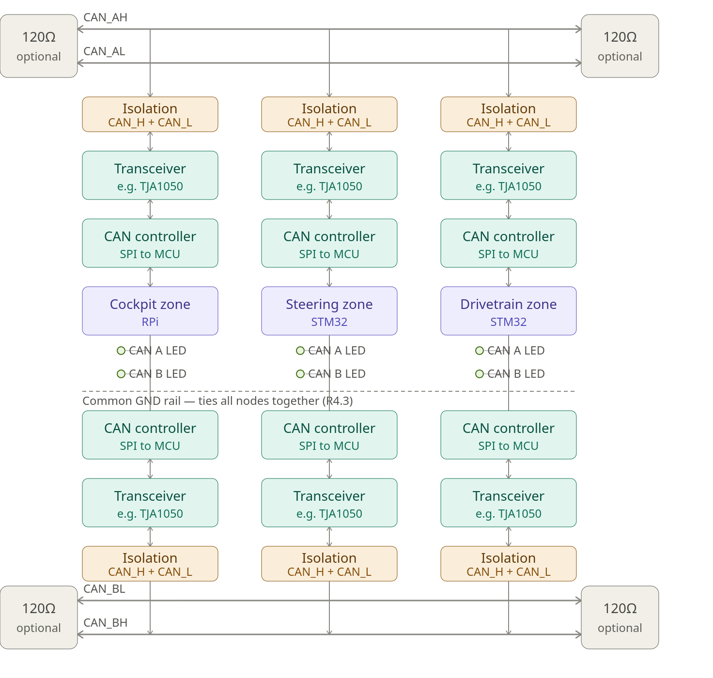

<!-- Print layout for Markdown Preview Enhanced / Prince PDF export. -->
<link rel="stylesheet" href="pdf-export.css" media="print">

# 18-649 Lab 1: Requirements Document

**Misho Alexandrov (mvalexan), Ore Abolade (oabolade), T'sairus Beasley (tbeasley)**

---

## 1. Introduction with system objective

### 1.1 Background

Modern vehicles are shifting from mechanical linkages to drive-by-wire systems, where sensors, embedded controllers, and actuators replace direct mechanical connections between driver inputs and vehicle response. This gives more flexibility but removes any mechanical fallback. The industry's response has been to move toward zone architectures: functionally related sensors/actuators are grouped under a zone controller, and zones communicate over a shared, fault-tolerant bus instead of point-to-point wiring.

### 1.2 System Objective

The objective is to provide electronic control of a tabletop car through coordinated cockpit, steering, and drivetrain zones. The system must:

- Translate cockpit steering, throttle, brake and turn-signal inputs into steering, drivetrain and blinker commands.
- Maintain target wheel velocity with encoder feedback; brake commands override throttle.
- Measure steering-actuator load and return force feedback to the driver's wheel.
- Transmit control, force-feedback, heartbeat and error messages in parallel on independent CAN A and CAN B.
- Continue operating without a switchover delay when either bus, or one node's connection to one bus, is lost.
- Detect zone failures and degraded CAN communication and apply defined degraded, error and recovery behavior.
- Coordinate fault recovery across all zones through defined system-state transitions.

### 1.3 Scope

The system has three zones — Cockpit (Raspberry Pi), Front/Steering, and Rear/Drivetrain (independently-clocked STM32s running an RTOS). The cockpit zone bridges a UDP proxy (wheel/pedal hardware) to the CAN network; the steering and drivetrain zones consume CAN control messages and drive the servo, motors, and blinkers. A custom PCB implements dual CAN A/B interfaces per zone with fault-injection jumpers, enabling systematic bus- and node-level fault testing.

---

## 2. System state chart

### Heartbeat behavior by state

- **INIT and SYSTEM_FAIL:** the zone continues transmitting its heartbeat on both CAN A and CAN B while in either of these states. In INIT, this lets other zones detect the new node coming online and lets the zone itself detect when it has heard back from everyone (satisfying the R3 power-up condition). In SYSTEM_FAIL, the zone is reacting to a fault it observed elsewhere (missed heartbeats from another zone, or an invalid control value) rather than a fault in itself — since it remains functional, it keeps heartbeating so the rest of the network sees it as healthy and doesn't mistakenly treat it as a second failure.
- **LOCAL_FAIL:** per R4.5, a zone that fails its own self-test must stop transmitting its heartbeat on both buses entirely. This is the signal the rest of the system uses to detect the failure (three consecutive missed heartbeats on both buses → SYSTEM_FAIL for everyone else). Heartbeat transmission does not resume until the zone receives a double press (within 500ms) and restores to NORMAL.

### CAN bus degradation

Bus health is tracked independently of, and does not affect, the state machine above. Each zone monitors CAN A and CAN B separately per R4.7: a bus is flagged degraded if no traffic from any other node has been seen on it for three heartbeat periods (60ms) while the other bus is still active. Degradation is reported via a per-bus status LED and in the zone's heartbeat payload, but does not force a transition out of NORMAL — the system must remain fully operational (no braking, no hazards) on a single healthy bus.

### Safe-state entry

Every state except NORMAL drives the zone to its documented safe output: motor PWM disabled with the H-Bridge in dynamic braking, blinkers flashing the hazard pattern, and the steering actuator continuing to track the commanded wheel angle. The one exception is the steering zone specifically in LOCAL_FAIL: since it is the zone that has failed, it stops tracking the steering wheel entirely rather than continuing to servo to a value it can no longer trust it's receiving correctly.

---

## 3. Sequence diagrams for each use-case (S1–S6)

**Use Case 1: Throttle** 

**Use Case 2: Brake** 

**Use Case 3: Steering** 

**Use Case 4: Blinkers** 

**Use Case 5: Self Test** 

**Use Case 6: CAN Bus Fault** 

## 4. Traceability for each use-case (S1–S6)

### 4.1 Use-case links

Each use case below links to its requirements, responsible zones and design documents. Code and verification links will be added as the system develops.

#### 4.1.1 S1 — Throttle Control

**Requirements:** R2.1; R3; S1; Rear (drivetrain) Zone.

**System behavior:**

- The cockpit receives throttle input over UDP and sends it on CAN A and CAN B. The drivetrain accepts the first valid copy and uses encoder feedback to maintain the target speed.
- With the brake released, target speed follows pedal angle. Use the average of both encoder speeds and document the throttle mapping and maximum speed.
- **R2.1:** Change motor PWM within 2 ms of cockpit UDP reception. If a nonzero speed is commanded but no encoder movement occurs for at least 200 ms, increase PWM up to the documented limit.
- **R3:** LOCAL_FAIL or SYSTEM_FAIL disables motor PWM and applies dynamic braking.

**Responsible zones:** Cockpit: input and CAN messages. Drivetrain: speed control, encoders, PWM and motor-current checks.

**Design links:**

- S1 sequence diagram: cockpit-to-drivetrain commands and encoder feedback.
- System state chart: NORMAL, LOCAL_FAIL and SYSTEM_FAIL outputs.
- Proposed timing analysis: throttle response.
- CAN message catalog: throttle/brake commands. Table of all team-defined values: speed mapping, limits and current thresholds.
- Code links — TBD: UDP input, throttle mapping, speed-control loop and motor driver.
- Verification links — TBD: Throttle mapping, speed regulation, stuck-wheel response and 2 ms timing.

#### 4.1.2 S2 — Brake Control

**Requirements:** R2.2; R3; S2.

**System behavior:**

- The cockpit sends brake input over both CAN buses. The drivetrain gives braking priority over throttle under all circumstances.
- **R2.2:** Disable PWM and apply H-Bridge dynamic braking within 2 ms of cockpit UDP reception.
- **R3:** Apply the same braking outputs in LOCAL_FAIL and SYSTEM_FAIL.

**Responsible zones:** Cockpit: brake input and CAN messages. Drivetrain: brake priority, PWM disable and H-Bridge control.

**Design links:**

- S2 sequence diagram: brake and normal-throttle paths.
- System state chart: safe braking outputs. Proposed timing analysis: brake response.
- CAN message catalog: brake message priority and payload. Table of all team-defined values: valid brake values.
- Code links — TBD: Brake input, brake/throttle priority and H-Bridge driver.
- Verification links — TBD: Brake priority, dynamic braking and 2 ms timing.

#### 4.1.3 S3 — Steering Wheel

**Requirements:** R2.3; R3; S3; Front (steering) Zone.

**System behavior:**

- The cockpit sends wheel position to the steering zone. The steering zone moves the servo, measures actuator load and sends force feedback back through the cockpit to the UDP proxy.
- Cover the full mechanical steering range with a monotonic mapping: moving the wheel farther in one direction must not reverse the commanded direction.
- **R2.3:** Update the servo signal within 50 ms of cockpit UDP reception. Send force over CAN at least every 50 ms and send the latest force to the UDP proxy every 50 ms.
- Document the load-to-force mapping and use signed force values from -100 to 100. Keep steering active in SYSTEM_FAIL unless the steering zone itself has failed; hold steering when it is isolated from both buses.

**Responsible zones:** Cockpit: wheel input and UDP force output. Steering: servo control and load measurement.

**Design links:**

- S3 sequence diagram: steering command and force-feedback paths.
- System state chart: steering behavior in NORMAL, SYSTEM_FAIL and LOCAL_FAIL.
- Proposed timing analysis: steering response and force-message periods.
- CAN message catalog: steering and force messages. Table of all team-defined values: steering range, sensing method and force mapping.
- Code links — TBD: Steering mapping, servo driver, load sensing and CAN-to-UDP force output.
- Verification links — TBD: Steering range, force feedback and 50 ms timing.

#### 4.1.4 S4 — Turn Signal and Hazard Blinkers

**Requirements:** R2.4; R3; S4.

**System behavior:**

- The cockpit sends the selected turn signal to both vehicle zones. Activate that side's front and rear blinkers and turn off the opposite side.
- Cancel the turn signal after the wheel crosses that side's turn threshold and returns past it.
- **R2.4:** Start blinking within 100 ms of cockpit UDP reception. Blink at 0.9–1.1 Hz with equal on/off time; keep front/rear changes on the same side within 1 ms.
- In the error state, override normal turn signals and flash all four hazards together at 2 Hz ±10%, with equal on/off time.

**Responsible zones:** Cockpit: button and wheel input. Steering: front blinkers. Drivetrain: rear blinkers. All zones: error-state coordination.

**Design links:**

- S4 sequence diagram: side selection, auto-cancel and hazard override; it proposes a shared CAN reception event to set blink timing.
- System state chart: hazard outputs. Proposed timing analysis: activation and synchronization limits.
- CAN message catalog: turn-signal and synchronization messages. Table of all team-defined values: turn thresholds and repeated-button behavior.
- Code links — TBD: Turn-signal state logic, auto-cancel, synchronized blinking and hazard override.
- Verification links — TBD: Blinker coverage required by Appendix A, including cancel behavior, timing and hazards.

#### 4.1.5 S5 — Self Test

**Requirements:** R2.5; R3; R4.5; S5.

**System behavior:**

- A single test-button press puts that zone in LOCAL_FAIL within 10 ms, stops its CAN transmissions and sets safe outputs. Treat presses less than 50 ms apart as one press.
- Other zones enter SYSTEM_FAIL within 100 ms of the press after three consecutive missed heartbeats from the failed zone on both buses.
- Send heartbeats every 20 ms ±10%. As described in the System state chart, healthy zones continue heartbeats in INIT and SYSTEM_FAIL; a zone in LOCAL_FAIL stops them.
- Two presses within 500 ms restore the failed zone. Return to NORMAL within 500 ms of restoration once heartbeats from all zones are received again.
- On startup, INIT keeps safe outputs until heartbeats arrive from every other zone on at least one bus. STM32 zones also need a valid control message. Invalid or out-of-range controls trigger SYSTEM_FAIL.

**Responsible zones:** All zones: failure detection and recovery. STM32s: hardware test buttons and independent watchdogs. Cockpit: game-controller test input; stop its heartbeat after 100 ms without UDP updates until updates resume.

**Design links:**

- S5 sequence diagram: drivetrain failure example; apply the same rules to each zone.
- System state chart: INIT, NORMAL, LOCAL_FAIL and SYSTEM_FAIL, including heartbeat behavior.
- Proposed timing analysis: local failure, error propagation and restoration.
- CAN message catalog: heartbeat/error messages. Table of all team-defined values: valid control ranges.
- Code links — TBD: Button handling, watchdogs, heartbeat checks, input validation and state recovery.
- Verification links — TBD: Failure in each zone, startup, invalid inputs, lost UDP updates and recovery timing.

#### 4.1.6 S6 — CAN Bus Fault Tolerance

**Requirements:** R2.1–R2.5; R3; R4.1–R4.8; S6.

**System behavior:**

- Send every message on CAN A and CAN B together. Accept the first valid copy and discard its duplicate using the sequence counter.
- Losing one bus or one node's connection to a bus must preserve all functions and R2 timing. Keep NORMAL with no switchover delay, hazards or braking caused by that fault.
- Mark a connection degraded after 60 ms without traffic from other nodes on that bus while the other bus works. Report it through the per-bus LED and heartbeat for cockpit logging.
- Support R4.8(a)–(f): one node off CAN A; one off CAN B; two nodes off opposite buses; one off both buses; complete loss of one bus; and jumper restoration.
- If a node loses both buses, the remaining zones enter SYSTEM_FAIL and the isolated node enters its own safe state. R4.8(d) requires error entry within 100 ms; isolated steering holds position.
- Clear the degraded indication within 100 ms of traffic resuming. Recover a bus-off controller within 100 ms of bus restoration and resume normal operation within 500 ms of jumper restoration, without reset or power cycle.

**Responsible zones:** All zones: independent CAN interfaces, duplicate handling, connection health and safe outputs. Cockpit: degraded-status logging.

**Design links:**

- S6 sequence diagram: single-bus loss, complete bus loss, isolation and restoration.
- Dual-CAN redundancy design: wiring, termination, jumpers and LEDs.
- CAN message catalog and bus utilization calculation: counters, priorities, heartbeat status and no more than 50% use per bus.
- Proposed timing analysis: deadlines with one bus remaining. System state chart: failure and recovery.
- Fault-injection test matrix: expected zone/LED states and recovery for R4.8(a)–(f).
- Code links — TBD: Dual-CAN hardware, receive filtering, status LEDs/logging and bus-off recovery.
- Verification links — TBD: R4.8(a)–(f) fault cases, zone/LED states and response/recovery times.

### 4.2 Keeping the links current

The sequence diagrams, state description, timing analysis, message catalog, team-defined values and redundancy design establish the initial design baseline. Final hardware-dependent values, code and verification links will be added as the work and evidence exist.

- Keep S1–S6 and the handout's requirement IDs unchanged. Use document headings, diagram names, CAN IDs and code links to identify the relevant work.
- Update affected links when behavior or design changes, including shared R1 architecture and R4 communication requirements. Check that every use case links to its requirements and every requirement links to a use case or other documented behavior.
- Record progress as Mapped, Designed, Implemented or Verified only when the supporting work exists. Use Needs review when a change may affect a link. Keep verification procedures and results in the Testing Document.

---

## 5. Proposed timing analysis

<table style="width:100%; max-width:100%; table-layout:fixed; border-collapse:collapse; font-size:7pt; line-height:1.15;">
<colgroup>
<col style="width:4%">
<col style="width:18%">
<col style="width:13%">
<col style="width:65%">
</colgroup>
<thead><tr>
<th style="padding:3pt; border:0.5pt solid #aab7c4; vertical-align:top; white-space:normal; overflow-wrap:anywhere; word-break:break-word; hyphens:auto; background:#17365d; color:#fff; text-align:left;">#</th>
<th style="padding:3pt; border:0.5pt solid #aab7c4; vertical-align:top; white-space:normal; overflow-wrap:anywhere; word-break:break-word; hyphens:auto; background:#17365d; color:#fff; text-align:left;">Requirement</th>
<th style="padding:3pt; border:0.5pt solid #aab7c4; vertical-align:top; white-space:normal; overflow-wrap:anywhere; word-break:break-word; hyphens:auto; background:#17365d; color:#fff; text-align:left;">Bound</th>
<th style="padding:3pt; border:0.5pt solid #aab7c4; vertical-align:top; white-space:normal; overflow-wrap:anywhere; word-break:break-word; hyphens:auto; background:#17365d; color:#fff; text-align:left;">Measurement method</th>
</tr></thead>
<tbody>
<tr>
<td style="padding:3pt; border:0.5pt solid #aab7c4; vertical-align:top; white-space:normal; overflow-wrap:anywhere; word-break:break-word; hyphens:auto; background:#fff;">1</td>
<td style="padding:3pt; border:0.5pt solid #aab7c4; vertical-align:top; white-space:normal; overflow-wrap:anywhere; word-break:break-word; hyphens:auto; background:#fff;">Throttle response</td>
<td style="padding:3pt; border:0.5pt solid #aab7c4; vertical-align:top; white-space:normal; overflow-wrap:anywhere; word-break:break-word; hyphens:auto; background:#fff;">≤2ms</td>
<td style="padding:3pt; border:0.5pt solid #aab7c4; vertical-align:top; white-space:normal; overflow-wrap:anywhere; word-break:break-word; hyphens:auto; background:#fff;">Cockpit-zone UDP-reception GPIO edge (t=0) vs. drivetrain motor PWM duty-cycle change, dual-channel oscilloscope capture.</td>
</tr>
<tr>
<td style="padding:3pt; border:0.5pt solid #aab7c4; vertical-align:top; white-space:normal; overflow-wrap:anywhere; word-break:break-word; hyphens:auto; background:#f3f6f8;">2</td>
<td style="padding:3pt; border:0.5pt solid #aab7c4; vertical-align:top; white-space:normal; overflow-wrap:anywhere; word-break:break-word; hyphens:auto; background:#f3f6f8;">Brake response</td>
<td style="padding:3pt; border:0.5pt solid #aab7c4; vertical-align:top; white-space:normal; overflow-wrap:anywhere; word-break:break-word; hyphens:auto; background:#f3f6f8;">≤2ms</td>
<td style="padding:3pt; border:0.5pt solid #aab7c4; vertical-align:top; white-space:normal; overflow-wrap:anywhere; word-break:break-word; hyphens:auto; background:#f3f6f8;">Cockpit-zone UDP-reception GPIO edge (t=0) vs. H-Bridge braking-mode/PWM-disable transition, dual-channel oscilloscope capture.</td>
</tr>
<tr>
<td style="padding:3pt; border:0.5pt solid #aab7c4; vertical-align:top; white-space:normal; overflow-wrap:anywhere; word-break:break-word; hyphens:auto; background:#fff;">3</td>
<td style="padding:3pt; border:0.5pt solid #aab7c4; vertical-align:top; white-space:normal; overflow-wrap:anywhere; word-break:break-word; hyphens:auto; background:#fff;">Steering response</td>
<td style="padding:3pt; border:0.5pt solid #aab7c4; vertical-align:top; white-space:normal; overflow-wrap:anywhere; word-break:break-word; hyphens:auto; background:#fff;">≤50ms</td>
<td style="padding:3pt; border:0.5pt solid #aab7c4; vertical-align:top; white-space:normal; overflow-wrap:anywhere; word-break:break-word; hyphens:auto; background:#fff;">Cockpit-zone UDP-reception GPIO edge (t=0) vs. servo control signal change, dual-channel oscilloscope capture.</td>
</tr>
<tr>
<td style="padding:3pt; border:0.5pt solid #aab7c4; vertical-align:top; white-space:normal; overflow-wrap:anywhere; word-break:break-word; hyphens:auto; background:#f3f6f8;">4</td>
<td style="padding:3pt; border:0.5pt solid #aab7c4; vertical-align:top; white-space:normal; overflow-wrap:anywhere; word-break:break-word; hyphens:auto; background:#f3f6f8;">Force feedback (CAN) period</td>
<td style="padding:3pt; border:0.5pt solid #aab7c4; vertical-align:top; white-space:normal; overflow-wrap:anywhere; word-break:break-word; hyphens:auto; background:#f3f6f8;">≤50ms</td>
<td style="padding:3pt; border:0.5pt solid #aab7c4; vertical-align:top; white-space:normal; overflow-wrap:anywhere; word-break:break-word; hyphens:auto; background:#f3f6f8;">USB-CAN adapter passively logging steering-zone force-feedback frame timestamps on CAN A/B; verify inter-frame period.</td>
</tr>
<tr>
<td style="padding:3pt; border:0.5pt solid #aab7c4; vertical-align:top; white-space:normal; overflow-wrap:anywhere; word-break:break-word; hyphens:auto; background:#fff;">5</td>
<td style="padding:3pt; border:0.5pt solid #aab7c4; vertical-align:top; white-space:normal; overflow-wrap:anywhere; word-break:break-word; hyphens:auto; background:#fff;">Force feedback (UDP) period</td>
<td style="padding:3pt; border:0.5pt solid #aab7c4; vertical-align:top; white-space:normal; overflow-wrap:anywhere; word-break:break-word; hyphens:auto; background:#fff;">≤50ms</td>
<td style="padding:3pt; border:0.5pt solid #aab7c4; vertical-align:top; white-space:normal; overflow-wrap:anywhere; word-break:break-word; hyphens:auto; background:#fff;">USB-CAN adapter timestamping inbound force-feedback CAN frames, cross-referenced against cockpit-zone UDP-transmit GPIO edge to confirm steady output period.</td>
</tr>
<tr>
<td style="padding:3pt; border:0.5pt solid #aab7c4; vertical-align:top; white-space:normal; overflow-wrap:anywhere; word-break:break-word; hyphens:auto; background:#f3f6f8;">6</td>
<td style="padding:3pt; border:0.5pt solid #aab7c4; vertical-align:top; white-space:normal; overflow-wrap:anywhere; word-break:break-word; hyphens:auto; background:#f3f6f8;">Turn signal response</td>
<td style="padding:3pt; border:0.5pt solid #aab7c4; vertical-align:top; white-space:normal; overflow-wrap:anywhere; word-break:break-word; hyphens:auto; background:#f3f6f8;">≤100ms</td>
<td style="padding:3pt; border:0.5pt solid #aab7c4; vertical-align:top; white-space:normal; overflow-wrap:anywhere; word-break:break-word; hyphens:auto; background:#f3f6f8;">Cockpit-zone UDP-reception GPIO edge (t=0) vs. blinker output test point, dual-channel oscilloscope capture.</td>
</tr>
<tr>
<td style="padding:3pt; border:0.5pt solid #aab7c4; vertical-align:top; white-space:normal; overflow-wrap:anywhere; word-break:break-word; hyphens:auto; background:#fff;">7</td>
<td style="padding:3pt; border:0.5pt solid #aab7c4; vertical-align:top; white-space:normal; overflow-wrap:anywhere; word-break:break-word; hyphens:auto; background:#fff;">Turn signal sync (front/rear)</td>
<td style="padding:3pt; border:0.5pt solid #aab7c4; vertical-align:top; white-space:normal; overflow-wrap:anywhere; word-break:break-word; hyphens:auto; background:#fff;">≤1ms</td>
<td style="padding:3pt; border:0.5pt solid #aab7c4; vertical-align:top; white-space:normal; overflow-wrap:anywhere; word-break:break-word; hyphens:auto; background:#fff;">Simultaneous two-channel oscilloscope capture of front and rear blinker test points (same side); measure edge-to-edge offset.</td>
</tr>
<tr>
<td style="padding:3pt; border:0.5pt solid #aab7c4; vertical-align:top; white-space:normal; overflow-wrap:anywhere; word-break:break-word; hyphens:auto; background:#f3f6f8;">8</td>
<td style="padding:3pt; border:0.5pt solid #aab7c4; vertical-align:top; white-space:normal; overflow-wrap:anywhere; word-break:break-word; hyphens:auto; background:#f3f6f8;">Local fail latency</td>
<td style="padding:3pt; border:0.5pt solid #aab7c4; vertical-align:top; white-space:normal; overflow-wrap:anywhere; word-break:break-word; hyphens:auto; background:#f3f6f8;">≤10ms</td>
<td style="padding:3pt; border:0.5pt solid #aab7c4; vertical-align:top; white-space:normal; overflow-wrap:anywhere; word-break:break-word; hyphens:auto; background:#f3f6f8;">Debounced test-button-press GPIO (added test point, t=0) vs. failing zone&#x27;s own safe-state output (PWM/H-Bridge or servo test point); cross-checked via USB-CAN adapter confirming heartbeat cessation on both buses.</td>
</tr>
<tr>
<td style="padding:3pt; border:0.5pt solid #aab7c4; vertical-align:top; white-space:normal; overflow-wrap:anywhere; word-break:break-word; hyphens:auto; background:#fff;">9</td>
<td style="padding:3pt; border:0.5pt solid #aab7c4; vertical-align:top; white-space:normal; overflow-wrap:anywhere; word-break:break-word; hyphens:auto; background:#fff;">System-wide fail propagation</td>
<td style="padding:3pt; border:0.5pt solid #aab7c4; vertical-align:top; white-space:normal; overflow-wrap:anywhere; word-break:break-word; hyphens:auto; background:#fff;">≤100ms</td>
<td style="padding:3pt; border:0.5pt solid #aab7c4; vertical-align:top; white-space:normal; overflow-wrap:anywhere; word-break:break-word; hyphens:auto; background:#fff;">Debounced test-button-press GPIO (t=0) vs. non-failed zones&#x27; hazard/braked outputs (blinker and motor test points); multi-channel or repeated single-channel capture across zones.</td>
</tr>
<tr>
<td style="padding:3pt; border:0.5pt solid #aab7c4; vertical-align:top; white-space:normal; overflow-wrap:anywhere; word-break:break-word; hyphens:auto; background:#f3f6f8;">10</td>
<td style="padding:3pt; border:0.5pt solid #aab7c4; vertical-align:top; white-space:normal; overflow-wrap:anywhere; word-break:break-word; hyphens:auto; background:#f3f6f8;">Heartbeat period</td>
<td style="padding:3pt; border:0.5pt solid #aab7c4; vertical-align:top; white-space:normal; overflow-wrap:anywhere; word-break:break-word; hyphens:auto; background:#f3f6f8;">20ms ±10%</td>
<td style="padding:3pt; border:0.5pt solid #aab7c4; vertical-align:top; white-space:normal; overflow-wrap:anywhere; word-break:break-word; hyphens:auto; background:#f3f6f8;">USB-CAN adapter passively logging each zone&#x27;s heartbeat frame timestamps on CAN A/B independently.</td>
</tr>
<tr>
<td style="padding:3pt; border:0.5pt solid #aab7c4; vertical-align:top; white-space:normal; overflow-wrap:anywhere; word-break:break-word; hyphens:auto; background:#fff;">11</td>
<td style="padding:3pt; border:0.5pt solid #aab7c4; vertical-align:top; white-space:normal; overflow-wrap:anywhere; word-break:break-word; hyphens:auto; background:#fff;">Bus degradation detection</td>
<td style="padding:3pt; border:0.5pt solid #aab7c4; vertical-align:top; white-space:normal; overflow-wrap:anywhere; word-break:break-word; hyphens:auto; background:#fff;">60ms (3 periods)</td>
<td style="padding:3pt; border:0.5pt solid #aab7c4; vertical-align:top; white-space:normal; overflow-wrap:anywhere; word-break:break-word; hyphens:auto; background:#fff;">USB-CAN adapter selectively suppressing/injecting traffic on one bus; timestamp gap to per-bus status LED assertion on affected zone.</td>
</tr>
<tr>
<td style="padding:3pt; border:0.5pt solid #aab7c4; vertical-align:top; white-space:normal; overflow-wrap:anywhere; word-break:break-word; hyphens:auto; background:#f3f6f8;">12</td>
<td style="padding:3pt; border:0.5pt solid #aab7c4; vertical-align:top; white-space:normal; overflow-wrap:anywhere; word-break:break-word; hyphens:auto; background:#f3f6f8;">Bus degradation recovery</td>
<td style="padding:3pt; border:0.5pt solid #aab7c4; vertical-align:top; white-space:normal; overflow-wrap:anywhere; word-break:break-word; hyphens:auto; background:#f3f6f8;">≤100ms</td>
<td style="padding:3pt; border:0.5pt solid #aab7c4; vertical-align:top; white-space:normal; overflow-wrap:anywhere; word-break:break-word; hyphens:auto; background:#f3f6f8;">USB-CAN adapter resuming traffic on degraded bus (t=0) vs. per-bus status LED clearing.</td>
</tr>
<tr>
<td style="padding:3pt; border:0.5pt solid #aab7c4; vertical-align:top; white-space:normal; overflow-wrap:anywhere; word-break:break-word; hyphens:auto; background:#fff;">13</td>
<td style="padding:3pt; border:0.5pt solid #aab7c4; vertical-align:top; white-space:normal; overflow-wrap:anywhere; word-break:break-word; hyphens:auto; background:#fff;">Isolation detection → fail-safe</td>
<td style="padding:3pt; border:0.5pt solid #aab7c4; vertical-align:top; white-space:normal; overflow-wrap:anywhere; word-break:break-word; hyphens:auto; background:#fff;">≤100ms (after 60ms detection)</td>
<td style="padding:3pt; border:0.5pt solid #aab7c4; vertical-align:top; white-space:normal; overflow-wrap:anywhere; word-break:break-word; hyphens:auto; background:#fff;">USB-CAN adapter suppressing all traffic on both buses; timestamp isolation conclusion (via zone&#x27;s status/LED) vs. fail-safe output activation on that zone&#x27;s test points.</td>
</tr>
<tr>
<td style="padding:3pt; border:0.5pt solid #aab7c4; vertical-align:top; white-space:normal; overflow-wrap:anywhere; word-break:break-word; hyphens:auto; background:#f3f6f8;">14</td>
<td style="padding:3pt; border:0.5pt solid #aab7c4; vertical-align:top; white-space:normal; overflow-wrap:anywhere; word-break:break-word; hyphens:auto; background:#f3f6f8;">Bus-off recovery</td>
<td style="padding:3pt; border:0.5pt solid #aab7c4; vertical-align:top; white-space:normal; overflow-wrap:anywhere; word-break:break-word; hyphens:auto; background:#f3f6f8;">≤100ms</td>
<td style="padding:3pt; border:0.5pt solid #aab7c4; vertical-align:top; white-space:normal; overflow-wrap:anywhere; word-break:break-word; hyphens:auto; background:#f3f6f8;">USB-CAN adapter inducing bus-off condition (e.g., forced error frames) then restoring bus; timestamp restoration vs. resumed valid frame transmission from the affected controller.</td>
</tr>
<tr>
<td style="padding:3pt; border:0.5pt solid #aab7c4; vertical-align:top; white-space:normal; overflow-wrap:anywhere; word-break:break-word; hyphens:auto; background:#fff;">15</td>
<td style="padding:3pt; border:0.5pt solid #aab7c4; vertical-align:top; white-space:normal; overflow-wrap:anywhere; word-break:break-word; hyphens:auto; background:#fff;">Jumper restoration recovery</td>
<td style="padding:3pt; border:0.5pt solid #aab7c4; vertical-align:top; white-space:normal; overflow-wrap:anywhere; word-break:break-word; hyphens:auto; background:#fff;">≤500ms</td>
<td style="padding:3pt; border:0.5pt solid #aab7c4; vertical-align:top; white-space:normal; overflow-wrap:anywhere; word-break:break-word; hyphens:auto; background:#fff;">Physical isolation-jumper restoration (t=0) vs. system resuming normal operation, confirmed via USB-CAN adapter (frame resumption) and relevant output test points.</td>
</tr>
<tr>
<td style="padding:3pt; border:0.5pt solid #aab7c4; vertical-align:top; white-space:normal; overflow-wrap:anywhere; word-break:break-word; hyphens:auto; background:#f3f6f8;">16</td>
<td style="padding:3pt; border:0.5pt solid #aab7c4; vertical-align:top; white-space:normal; overflow-wrap:anywhere; word-break:break-word; hyphens:auto; background:#f3f6f8;">Test-button restore</td>
<td style="padding:3pt; border:0.5pt solid #aab7c4; vertical-align:top; white-space:normal; overflow-wrap:anywhere; word-break:break-word; hyphens:auto; background:#f3f6f8;">≤500ms</td>
<td style="padding:3pt; border:0.5pt solid #aab7c4; vertical-align:top; white-space:normal; overflow-wrap:anywhere; word-break:break-word; hyphens:auto; background:#f3f6f8;">Second (double-press) debounced test-button GPIO edge (t=0) vs. resumed heartbeats (USB-CAN adapter) and other zones&#x27; outputs returning to normal tracking/response behavior.</td>
</tr>
</tbody></table>

---

## 6. CAN message catalog (R4.4) and bus utilization calculation (R4.6)

All inter-zone messages are transmitted simultaneously on CAN A and CAN B. The receiver accepts the first valid copy and discards the later duplicate using the sequence counter.

### Proposed CAN message catalog

The identifiers below are proposed standard 11-bit CAN IDs. They use one vehicle-control message so steering, throttle, brake and turn-signal data stay consistent across the Front/Steering Zone and Rear/Drivetrain Zone. Final IDs and signal scales must be copied into the CAN message catalog after the team confirms the hardware and UDP input ranges.

<table style="width:100%; max-width:100%; table-layout:fixed; border-collapse:collapse; font-size:7pt; line-height:1.15;">
<colgroup>
<col style="width:15%">
<col style="width:8%">
<col style="width:18%">
<col style="width:27%">
<col style="width:20%">
<col style="width:12%">
</colgroup>
<thead><tr>
<th style="padding:3pt; border:0.5pt solid #aab7c4; vertical-align:top; white-space:normal; overflow-wrap:anywhere; word-break:break-word; hyphens:auto; background:#17365d; color:#fff; text-align:left;">Message</th>
<th style="padding:3pt; border:0.5pt solid #aab7c4; vertical-align:top; white-space:normal; overflow-wrap:anywhere; word-break:break-word; hyphens:auto; background:#17365d; color:#fff; text-align:left;">Proposed ID</th>
<th style="padding:3pt; border:0.5pt solid #aab7c4; vertical-align:top; white-space:normal; overflow-wrap:anywhere; word-break:break-word; hyphens:auto; background:#17365d; color:#fff; text-align:left;">Sender → receiver(s)</th>
<th style="padding:3pt; border:0.5pt solid #aab7c4; vertical-align:top; white-space:normal; overflow-wrap:anywhere; word-break:break-word; hyphens:auto; background:#17365d; color:#fff; text-align:left;">Payload layout</th>
<th style="padding:3pt; border:0.5pt solid #aab7c4; vertical-align:top; white-space:normal; overflow-wrap:anywhere; word-break:break-word; hyphens:auto; background:#17365d; color:#fff; text-align:left;">Rate / trigger</th>
<th style="padding:3pt; border:0.5pt solid #aab7c4; vertical-align:top; white-space:normal; overflow-wrap:anywhere; word-break:break-word; hyphens:auto; background:#17365d; color:#fff; text-align:left;">Priority reason</th>
</tr></thead>
<tbody>
<tr>
<td style="padding:3pt; border:0.5pt solid #aab7c4; vertical-align:top; white-space:normal; overflow-wrap:anywhere; word-break:break-word; hyphens:auto; background:#fff;">SYSTEM_ERROR</td>
<td style="padding:3pt; border:0.5pt solid #aab7c4; vertical-align:top; white-space:normal; overflow-wrap:anywhere; word-break:break-word; hyphens:auto; background:#fff;">0x080</td>
<td style="padding:3pt; border:0.5pt solid #aab7c4; vertical-align:top; white-space:normal; overflow-wrap:anywhere; word-break:break-word; hyphens:auto; background:#fff;">Any zone → all zones</td>
<td style="padding:3pt; border:0.5pt solid #aab7c4; vertical-align:top; white-space:normal; overflow-wrap:anywhere; word-break:break-word; hyphens:auto; background:#fff;">B0: version + seq[3:0]; B1: source zone; B2: error reason; B3: state; B4–B7: reserved</td>
<td style="padding:3pt; border:0.5pt solid #aab7c4; vertical-align:top; white-space:normal; overflow-wrap:anywhere; word-break:break-word; hyphens:auto; background:#fff;">On SYSTEM_FAIL entry; repeat ≤50 ms while active</td>
<td style="padding:3pt; border:0.5pt solid #aab7c4; vertical-align:top; white-space:normal; overflow-wrap:anywhere; word-break:break-word; hyphens:auto; background:#fff;">Highest: commands safe outputs.</td>
</tr>
<tr>
<td style="padding:3pt; border:0.5pt solid #aab7c4; vertical-align:top; white-space:normal; overflow-wrap:anywhere; word-break:break-word; hyphens:auto; background:#f3f6f8;">VEHICLE_CONTROL</td>
<td style="padding:3pt; border:0.5pt solid #aab7c4; vertical-align:top; white-space:normal; overflow-wrap:anywhere; word-break:break-word; hyphens:auto; background:#f3f6f8;">0x100</td>
<td style="padding:3pt; border:0.5pt solid #aab7c4; vertical-align:top; white-space:normal; overflow-wrap:anywhere; word-break:break-word; hyphens:auto; background:#f3f6f8;">Cockpit → steering, drivetrain</td>
<td style="padding:3pt; border:0.5pt solid #aab7c4; vertical-align:top; white-space:normal; overflow-wrap:anywhere; word-break:break-word; hyphens:auto; background:#f3f6f8;">B0: version + seq[3:0]; B1: throttle 0–100%; B2: brake 0–100%; B3–B4: steering −1000…+1000; B5: turn state; B6: control flags; B7: reserved</td>
<td style="padding:3pt; border:0.5pt solid #aab7c4; vertical-align:top; white-space:normal; overflow-wrap:anywhere; word-break:break-word; hyphens:auto; background:#f3f6f8;">Every UDP update; gap ≤50 ms</td>
<td style="padding:3pt; border:0.5pt solid #aab7c4; vertical-align:top; white-space:normal; overflow-wrap:anywhere; word-break:break-word; hyphens:auto; background:#f3f6f8;">High: carries brake and current driver control.</td>
</tr>
<tr>
<td style="padding:3pt; border:0.5pt solid #aab7c4; vertical-align:top; white-space:normal; overflow-wrap:anywhere; word-break:break-word; hyphens:auto; background:#fff;">HEARTBEAT_COCKPIT</td>
<td style="padding:3pt; border:0.5pt solid #aab7c4; vertical-align:top; white-space:normal; overflow-wrap:anywhere; word-break:break-word; hyphens:auto; background:#fff;">0x300</td>
<td style="padding:3pt; border:0.5pt solid #aab7c4; vertical-align:top; white-space:normal; overflow-wrap:anywhere; word-break:break-word; hyphens:auto; background:#fff;">Cockpit → steering, drivetrain</td>
<td style="padding:3pt; border:0.5pt solid #aab7c4; vertical-align:top; white-space:normal; overflow-wrap:anywhere; word-break:break-word; hyphens:auto; background:#fff;">B0: version + seq[3:0]; B1: INIT/NORMAL/LOCAL_FAIL/SYSTEM_FAIL; B2: CAN A/B health flags; B3: error code; B4–B7: reserved</td>
<td style="padding:3pt; border:0.5pt solid #aab7c4; vertical-align:top; white-space:normal; overflow-wrap:anywhere; word-break:break-word; hyphens:auto; background:#fff;">Every 20 ms ±10% while the zone is healthy</td>
<td style="padding:3pt; border:0.5pt solid #aab7c4; vertical-align:top; white-space:normal; overflow-wrap:anywhere; word-break:break-word; hyphens:auto; background:#fff;">Needed for failure detection.</td>
</tr>
<tr>
<td style="padding:3pt; border:0.5pt solid #aab7c4; vertical-align:top; white-space:normal; overflow-wrap:anywhere; word-break:break-word; hyphens:auto; background:#f3f6f8;">HEARTBEAT_STEERING</td>
<td style="padding:3pt; border:0.5pt solid #aab7c4; vertical-align:top; white-space:normal; overflow-wrap:anywhere; word-break:break-word; hyphens:auto; background:#f3f6f8;">0x301</td>
<td style="padding:3pt; border:0.5pt solid #aab7c4; vertical-align:top; white-space:normal; overflow-wrap:anywhere; word-break:break-word; hyphens:auto; background:#f3f6f8;">Steering → cockpit, drivetrain</td>
<td style="padding:3pt; border:0.5pt solid #aab7c4; vertical-align:top; white-space:normal; overflow-wrap:anywhere; word-break:break-word; hyphens:auto; background:#f3f6f8;">Same layout as HEARTBEAT_COCKPIT</td>
<td style="padding:3pt; border:0.5pt solid #aab7c4; vertical-align:top; white-space:normal; overflow-wrap:anywhere; word-break:break-word; hyphens:auto; background:#f3f6f8;">Every 20 ms ±10% while the zone is healthy</td>
<td style="padding:3pt; border:0.5pt solid #aab7c4; vertical-align:top; white-space:normal; overflow-wrap:anywhere; word-break:break-word; hyphens:auto; background:#f3f6f8;">Needed for failure detection.</td>
</tr>
<tr>
<td style="padding:3pt; border:0.5pt solid #aab7c4; vertical-align:top; white-space:normal; overflow-wrap:anywhere; word-break:break-word; hyphens:auto; background:#fff;">HEARTBEAT_DRIVETRAIN</td>
<td style="padding:3pt; border:0.5pt solid #aab7c4; vertical-align:top; white-space:normal; overflow-wrap:anywhere; word-break:break-word; hyphens:auto; background:#fff;">0x302</td>
<td style="padding:3pt; border:0.5pt solid #aab7c4; vertical-align:top; white-space:normal; overflow-wrap:anywhere; word-break:break-word; hyphens:auto; background:#fff;">Drivetrain → cockpit, steering</td>
<td style="padding:3pt; border:0.5pt solid #aab7c4; vertical-align:top; white-space:normal; overflow-wrap:anywhere; word-break:break-word; hyphens:auto; background:#fff;">Same layout as HEARTBEAT_COCKPIT</td>
<td style="padding:3pt; border:0.5pt solid #aab7c4; vertical-align:top; white-space:normal; overflow-wrap:anywhere; word-break:break-word; hyphens:auto; background:#fff;">Every 20 ms ±10% while the zone is healthy</td>
<td style="padding:3pt; border:0.5pt solid #aab7c4; vertical-align:top; white-space:normal; overflow-wrap:anywhere; word-break:break-word; hyphens:auto; background:#fff;">Needed for failure detection.</td>
</tr>
<tr>
<td style="padding:3pt; border:0.5pt solid #aab7c4; vertical-align:top; white-space:normal; overflow-wrap:anywhere; word-break:break-word; hyphens:auto; background:#f3f6f8;">FORCE_FEEDBACK</td>
<td style="padding:3pt; border:0.5pt solid #aab7c4; vertical-align:top; white-space:normal; overflow-wrap:anywhere; word-break:break-word; hyphens:auto; background:#f3f6f8;">0x400</td>
<td style="padding:3pt; border:0.5pt solid #aab7c4; vertical-align:top; white-space:normal; overflow-wrap:anywhere; word-break:break-word; hyphens:auto; background:#f3f6f8;">Steering → cockpit</td>
<td style="padding:3pt; border:0.5pt solid #aab7c4; vertical-align:top; white-space:normal; overflow-wrap:anywhere; word-break:break-word; hyphens:auto; background:#f3f6f8;">B0: version + seq[3:0]; B1: signed force −100…+100; B2: load status; B3–B7: reserved</td>
<td style="padding:3pt; border:0.5pt solid #aab7c4; vertical-align:top; white-space:normal; overflow-wrap:anywhere; word-break:break-word; hyphens:auto; background:#f3f6f8;">At least every 50 ms</td>
<td style="padding:3pt; border:0.5pt solid #aab7c4; vertical-align:top; white-space:normal; overflow-wrap:anywhere; word-break:break-word; hyphens:auto; background:#f3f6f8;">Convenience feedback; below safety messages.</td>
</tr>
</tbody></table>

### Message-handling rules

- A receiver checks the CAN ID, expected frame length, message version, sequence counter and every documented value range. A malformed or out-of-range control value causes SYSTEM_FAIL.
- Each receiver stores the newest sequence counter for each message. It accepts the first valid copy from either bus and discards the second copy with the same counter.
- A counter wraparound is valid after 15. A copy with the same counter is a duplicate only within the expected CAN A/CAN B arrival window; a later new message may reuse that counter after wraparound.
- VEHICLE_CONTROL is sent for every UDP state update and at least once every 50 ms. In SYSTEM_FAIL, SYSTEM_ERROR is sent on entry and then at least once every 50 ms while the state remains active.
- Heartbeat bus-health flags report whether CAN A or CAN B is degraded. Missing heartbeats on one bus alone indicate degraded communication, not a failed zone.

### Worst-case bus-utilization calculation

Calculate CAN A and CAN B separately. They carry the same set of messages, so the utilization calculation is the same for each bus. At 500 kbit/s, use a conservative 160 bit-times per 8-byte standard CAN frame, including protocol overhead, possible bit stuffing and inter-frame space. This equals 0.320 ms per frame.

For each message: utilization (%) = frame rate (frames/s) × 160 / 500,000 × 100. Add every periodic message and the highest expected event-driven message rate. The total must stay at or below 50% on each bus.

<table style="width:100%; max-width:100%; table-layout:fixed; border-collapse:collapse; font-size:7pt; line-height:1.15;">
<colgroup>
<col style="width:32%">
<col style="width:28%">
<col style="width:18%">
<col style="width:22%">
</colgroup>
<thead><tr>
<th style="padding:3pt; border:0.5pt solid #aab7c4; vertical-align:top; white-space:normal; overflow-wrap:anywhere; word-break:break-word; hyphens:auto; background:#17365d; color:#fff; text-align:left;">Traffic source</th>
<th style="padding:3pt; border:0.5pt solid #aab7c4; vertical-align:top; white-space:normal; overflow-wrap:anywhere; word-break:break-word; hyphens:auto; background:#17365d; color:#fff; text-align:left;">Worst-case rate per bus</th>
<th style="padding:3pt; border:0.5pt solid #aab7c4; vertical-align:top; white-space:normal; overflow-wrap:anywhere; word-break:break-word; hyphens:auto; background:#17365d; color:#fff; text-align:left;">Frame budget</th>
<th style="padding:3pt; border:0.5pt solid #aab7c4; vertical-align:top; white-space:normal; overflow-wrap:anywhere; word-break:break-word; hyphens:auto; background:#17365d; color:#fff; text-align:left;">Utilization per bus</th>
</tr></thead>
<tbody>
<tr>
<td style="padding:3pt; border:0.5pt solid #aab7c4; vertical-align:top; white-space:normal; overflow-wrap:anywhere; word-break:break-word; hyphens:auto; background:#fff;">HEARTBEAT_COCKPIT / STEERING / DRIVETRAIN</td>
<td style="padding:3pt; border:0.5pt solid #aab7c4; vertical-align:top; white-space:normal; overflow-wrap:anywhere; word-break:break-word; hyphens:auto; background:#fff;">3 × 50 = 150 frames/s</td>
<td style="padding:3pt; border:0.5pt solid #aab7c4; vertical-align:top; white-space:normal; overflow-wrap:anywhere; word-break:break-word; hyphens:auto; background:#fff;">160 bits/frame</td>
<td style="padding:3pt; border:0.5pt solid #aab7c4; vertical-align:top; white-space:normal; overflow-wrap:anywhere; word-break:break-word; hyphens:auto; background:#fff;">4.80%</td>
</tr>
<tr>
<td style="padding:3pt; border:0.5pt solid #aab7c4; vertical-align:top; white-space:normal; overflow-wrap:anywhere; word-break:break-word; hyphens:auto; background:#f3f6f8;">FORCE_FEEDBACK</td>
<td style="padding:3pt; border:0.5pt solid #aab7c4; vertical-align:top; white-space:normal; overflow-wrap:anywhere; word-break:break-word; hyphens:auto; background:#f3f6f8;">20 frames/s</td>
<td style="padding:3pt; border:0.5pt solid #aab7c4; vertical-align:top; white-space:normal; overflow-wrap:anywhere; word-break:break-word; hyphens:auto; background:#f3f6f8;">160 bits/frame</td>
<td style="padding:3pt; border:0.5pt solid #aab7c4; vertical-align:top; white-space:normal; overflow-wrap:anywhere; word-break:break-word; hyphens:auto; background:#f3f6f8;">0.64%</td>
</tr>
<tr>
<td style="padding:3pt; border:0.5pt solid #aab7c4; vertical-align:top; white-space:normal; overflow-wrap:anywhere; word-break:break-word; hyphens:auto; background:#fff;">VEHICLE_CONTROL</td>
<td style="padding:3pt; border:0.5pt solid #aab7c4; vertical-align:top; white-space:normal; overflow-wrap:anywhere; word-break:break-word; hyphens:auto; background:#fff;">F_UDP_MAX frames/s</td>
<td style="padding:3pt; border:0.5pt solid #aab7c4; vertical-align:top; white-space:normal; overflow-wrap:anywhere; word-break:break-word; hyphens:auto; background:#fff;">160 bits/frame</td>
<td style="padding:3pt; border:0.5pt solid #aab7c4; vertical-align:top; white-space:normal; overflow-wrap:anywhere; word-break:break-word; hyphens:auto; background:#fff;">0.032 × F_UDP_MAX %</td>
</tr>
<tr>
<td style="padding:3pt; border:0.5pt solid #aab7c4; vertical-align:top; white-space:normal; overflow-wrap:anywhere; word-break:break-word; hyphens:auto; background:#f3f6f8;">SYSTEM_ERROR</td>
<td style="padding:3pt; border:0.5pt solid #aab7c4; vertical-align:top; white-space:normal; overflow-wrap:anywhere; word-break:break-word; hyphens:auto; background:#f3f6f8;">F_ERROR_MAX frames/s</td>
<td style="padding:3pt; border:0.5pt solid #aab7c4; vertical-align:top; white-space:normal; overflow-wrap:anywhere; word-break:break-word; hyphens:auto; background:#f3f6f8;">160 bits/frame</td>
<td style="padding:3pt; border:0.5pt solid #aab7c4; vertical-align:top; white-space:normal; overflow-wrap:anywhere; word-break:break-word; hyphens:auto; background:#f3f6f8;">0.032 × F_ERROR_MAX %</td>
</tr>
<tr>
<td style="padding:3pt; border:0.5pt solid #aab7c4; vertical-align:top; white-space:normal; overflow-wrap:anywhere; word-break:break-word; hyphens:auto; background:#fff;"><strong>Total</strong></td>
<td style="padding:3pt; border:0.5pt solid #aab7c4; vertical-align:top; white-space:normal; overflow-wrap:anywhere; word-break:break-word; hyphens:auto; background:#fff;">170 + F_UDP_MAX + F_ERROR_MAX frames/s</td>
<td style="padding:3pt; border:0.5pt solid #aab7c4; vertical-align:top; white-space:normal; overflow-wrap:anywhere; word-break:break-word; hyphens:auto; background:#fff;">160 bits/frame</td>
<td style="padding:3pt; border:0.5pt solid #aab7c4; vertical-align:top; white-space:normal; overflow-wrap:anywhere; word-break:break-word; hyphens:auto; background:#fff;">5.44 + 0.032 × (F_UDP_MAX + F_ERROR_MAX) %</td>
</tr>
<tr>
<td style="padding:3pt; border:0.5pt solid #aab7c4; vertical-align:top; white-space:normal; overflow-wrap:anywhere; word-break:break-word; hyphens:auto; background:#f3f6f8;">Example planning case</td>
<td style="padding:3pt; border:0.5pt solid #aab7c4; vertical-align:top; white-space:normal; overflow-wrap:anywhere; word-break:break-word; hyphens:auto; background:#f3f6f8;">100 UDP updates/s; 20 error messages/s</td>
<td style="padding:3pt; border:0.5pt solid #aab7c4; vertical-align:top; white-space:normal; overflow-wrap:anywhere; word-break:break-word; hyphens:auto; background:#f3f6f8;">160 bits/frame</td>
<td style="padding:3pt; border:0.5pt solid #aab7c4; vertical-align:top; white-space:normal; overflow-wrap:anywhere; word-break:break-word; hyphens:auto; background:#f3f6f8;">9.28%</td>
</tr>
</tbody></table>

With the proposed catalog, the periodic load excluding vehicle-control traffic is 3 heartbeats × 50 Hz + 1 force-feedback message × 20 Hz = 170 frames/s, or 5.44% per bus. Add VEHICLE_CONTROL at F_UDP_MAX: its load is 0.032 × F_UDP_MAX percent per bus. Add the selected SYSTEM_ERROR rate when the error state is active. At 100 UDP updates/s and 20 SYSTEM_ERROR messages/s, the estimated total is 9.28% per bus. This is a planning estimate; rechecks occur after payload sizes and maximum UDP rate are set.

### External CAN observation and validation

- Use a USB-CAN adapter or CAN analyzer on the CAN A and CAN B test headers. Capture IDs, payloads, sequence counters, and timestamps on both buses.
- Compare measured frame counts over a fixed window with the catalog rates and utilization calculation. Confirm that every message appears on both buses and that a receiver uses only the first valid copy.
- Use an oscilloscope for end-to-end timing: cockpit UDP-receive GPIO as the start point and the receiving-zone output test point as the end point. Use the CAN test header or CAN-transmit/receive GPIOs to isolate CAN latency when needed.
- During jumper fault injection, capture the remaining bus. Confirm that it continues carrying control traffic within R2 limits, status LEDs show degradation, and recovery times meet the timing analysis.

---

## 7. Table of all team-defined values

Record team choices here as the design develops. Proposed values are starting points, not final decisions. Hardware-dependent values cannot be finalized until components are selected; calibration values need measurements on the assembled system.

**Status guide:** Fixed by handout = mandatory; Proposed = suggested behavior; Hardware-dependent = depends on purchased or developed hardware; Design-dependent = software/interface choice; Needs calibration = must be measured or tuned.

### Driver inputs and steering

<table style="width:100%; max-width:100%; table-layout:fixed; border-collapse:collapse; font-size:7pt; line-height:1.15;">
<colgroup>
<col style="width:18%">
<col style="width:28%">
<col style="width:38%">
<col style="width:16%">
</colgroup>
<thead><tr>
<th style="padding:3pt; border:0.5pt solid #aab7c4; vertical-align:top; white-space:normal; overflow-wrap:anywhere; word-break:break-word; hyphens:auto; background:#17365d; color:#fff; text-align:left;">Value</th>
<th style="padding:3pt; border:0.5pt solid #aab7c4; vertical-align:top; white-space:normal; overflow-wrap:anywhere; word-break:break-word; hyphens:auto; background:#17365d; color:#fff; text-align:left;">Current choice / units</th>
<th style="padding:3pt; border:0.5pt solid #aab7c4; vertical-align:top; white-space:normal; overflow-wrap:anywhere; word-break:break-word; hyphens:auto; background:#17365d; color:#fff; text-align:left;">Reason / hardware dependency</th>
<th style="padding:3pt; border:0.5pt solid #aab7c4; vertical-align:top; white-space:normal; overflow-wrap:anywhere; word-break:break-word; hyphens:auto; background:#17365d; color:#fff; text-align:left;">Status</th>
</tr></thead>
<tbody>
<tr>
<td style="padding:3pt; border:0.5pt solid #aab7c4; vertical-align:top; white-space:normal; overflow-wrap:anywhere; word-break:break-word; hyphens:auto; background:#fff;">Steering input</td>
<td style="padding:3pt; border:0.5pt solid #aab7c4; vertical-align:top; white-space:normal; overflow-wrap:anywhere; word-break:break-word; hyphens:auto; background:#fff;">TBD: min, center, max; raw units</td>
<td style="padding:3pt; border:0.5pt solid #aab7c4; vertical-align:top; white-space:normal; overflow-wrap:anywhere; word-break:break-word; hyphens:auto; background:#fff;">Read UDP values; check wheel model and direction.</td>
<td style="padding:3pt; border:0.5pt solid #aab7c4; vertical-align:top; white-space:normal; overflow-wrap:anywhere; word-break:break-word; hyphens:auto; background:#fff;">Needs calibration</td>
</tr>
<tr>
<td style="padding:3pt; border:0.5pt solid #aab7c4; vertical-align:top; white-space:normal; overflow-wrap:anywhere; word-break:break-word; hyphens:auto; background:#f3f6f8;">Servo travel</td>
<td style="padding:3pt; border:0.5pt solid #aab7c4; vertical-align:top; white-space:normal; overflow-wrap:anywhere; word-break:break-word; hyphens:auto; background:#f3f6f8;">TBD: left, center, right; degrees and pulse width</td>
<td style="padding:3pt; border:0.5pt solid #aab7c4; vertical-align:top; white-space:normal; overflow-wrap:anywhere; word-break:break-word; hyphens:auto; background:#f3f6f8;">Depends on servo, linkage and chassis travel.</td>
<td style="padding:3pt; border:0.5pt solid #aab7c4; vertical-align:top; white-space:normal; overflow-wrap:anywhere; word-break:break-word; hyphens:auto; background:#f3f6f8;">Hardware-dependent</td>
</tr>
<tr>
<td style="padding:3pt; border:0.5pt solid #aab7c4; vertical-align:top; white-space:normal; overflow-wrap:anywhere; word-break:break-word; hyphens:auto; background:#fff;">Steering mapping</td>
<td style="padding:3pt; border:0.5pt solid #aab7c4; vertical-align:top; white-space:normal; overflow-wrap:anywhere; word-break:break-word; hyphens:auto; background:#fff;">Monotonic; full usable steering range</td>
<td style="padding:3pt; border:0.5pt solid #aab7c4; vertical-align:top; white-space:normal; overflow-wrap:anywhere; word-break:break-word; hyphens:auto; background:#fff;">Required behavior; endpoints need calibration.</td>
<td style="padding:3pt; border:0.5pt solid #aab7c4; vertical-align:top; white-space:normal; overflow-wrap:anywhere; word-break:break-word; hyphens:auto; background:#fff;">Fixed rule; values TBD</td>
</tr>
<tr>
<td style="padding:3pt; border:0.5pt solid #aab7c4; vertical-align:top; white-space:normal; overflow-wrap:anywhere; word-break:break-word; hyphens:auto; background:#f3f6f8;">Throttle input</td>
<td style="padding:3pt; border:0.5pt solid #aab7c4; vertical-align:top; white-space:normal; overflow-wrap:anywhere; word-break:break-word; hyphens:auto; background:#f3f6f8;">TBD: released/full values; raw units</td>
<td style="padding:3pt; border:0.5pt solid #aab7c4; vertical-align:top; white-space:normal; overflow-wrap:anywhere; word-break:break-word; hyphens:auto; background:#f3f6f8;">Read UDP pedal values; measure rest noise.</td>
<td style="padding:3pt; border:0.5pt solid #aab7c4; vertical-align:top; white-space:normal; overflow-wrap:anywhere; word-break:break-word; hyphens:auto; background:#f3f6f8;">Needs calibration</td>
</tr>
<tr>
<td style="padding:3pt; border:0.5pt solid #aab7c4; vertical-align:top; white-space:normal; overflow-wrap:anywhere; word-break:break-word; hyphens:auto; background:#fff;">Throttle mapping</td>
<td style="padding:3pt; border:0.5pt solid #aab7c4; vertical-align:top; white-space:normal; overflow-wrap:anywhere; word-break:break-word; hyphens:auto; background:#fff;">Linear target speed vs pedal travel</td>
<td style="padding:3pt; border:0.5pt solid #aab7c4; vertical-align:top; white-space:normal; overflow-wrap:anywhere; word-break:break-word; hyphens:auto; background:#fff;">Starting point for S1; normalize input first.</td>
<td style="padding:3pt; border:0.5pt solid #aab7c4; vertical-align:top; white-space:normal; overflow-wrap:anywhere; word-break:break-word; hyphens:auto; background:#fff;">Proposed</td>
</tr>
<tr>
<td style="padding:3pt; border:0.5pt solid #aab7c4; vertical-align:top; white-space:normal; overflow-wrap:anywhere; word-break:break-word; hyphens:auto; background:#f3f6f8;">Maximum speed</td>
<td style="padding:3pt; border:0.5pt solid #aab7c4; vertical-align:top; white-space:normal; overflow-wrap:anywhere; word-break:break-word; hyphens:auto; background:#f3f6f8;">TBD; wheel rpm or m/s</td>
<td style="padding:3pt; border:0.5pt solid #aab7c4; vertical-align:top; white-space:normal; overflow-wrap:anywhere; word-break:break-word; hyphens:auto; background:#f3f6f8;">Depends on motor, gearing, wheel size and supply.</td>
<td style="padding:3pt; border:0.5pt solid #aab7c4; vertical-align:top; white-space:normal; overflow-wrap:anywhere; word-break:break-word; hyphens:auto; background:#f3f6f8;">Hardware-dependent</td>
</tr>
<tr>
<td style="padding:3pt; border:0.5pt solid #aab7c4; vertical-align:top; white-space:normal; overflow-wrap:anywhere; word-break:break-word; hyphens:auto; background:#fff;">Brake activation</td>
<td style="padding:3pt; border:0.5pt solid #aab7c4; vertical-align:top; white-space:normal; overflow-wrap:anywhere; word-break:break-word; hyphens:auto; background:#fff;">TBD threshold; raw or normalized units</td>
<td style="padding:3pt; border:0.5pt solid #aab7c4; vertical-align:top; white-space:normal; overflow-wrap:anywhere; word-break:break-word; hyphens:auto; background:#fff;">S2 uses brake &gt; 0; confirm encoding and noise.</td>
<td style="padding:3pt; border:0.5pt solid #aab7c4; vertical-align:top; white-space:normal; overflow-wrap:anywhere; word-break:break-word; hyphens:auto; background:#fff;">Needs calibration</td>
</tr>
<tr>
<td style="padding:3pt; border:0.5pt solid #aab7c4; vertical-align:top; white-space:normal; overflow-wrap:anywhere; word-break:break-word; hyphens:auto; background:#f3f6f8;">Brake priority</td>
<td style="padding:3pt; border:0.5pt solid #aab7c4; vertical-align:top; white-space:normal; overflow-wrap:anywhere; word-break:break-word; hyphens:auto; background:#f3f6f8;">Brake overrides throttle</td>
<td style="padding:3pt; border:0.5pt solid #aab7c4; vertical-align:top; white-space:normal; overflow-wrap:anywhere; word-break:break-word; hyphens:auto; background:#f3f6f8;">Required by S2; dynamic braking with PWM off.</td>
<td style="padding:3pt; border:0.5pt solid #aab7c4; vertical-align:top; white-space:normal; overflow-wrap:anywhere; word-break:break-word; hyphens:auto; background:#f3f6f8;">Fixed by handout</td>
</tr>
</tbody></table>

### Turn signals, buttons and force feedback

<table style="width:100%; max-width:100%; table-layout:fixed; border-collapse:collapse; font-size:7pt; line-height:1.15;">
<colgroup>
<col style="width:18%">
<col style="width:28%">
<col style="width:38%">
<col style="width:16%">
</colgroup>
<thead><tr>
<th style="padding:3pt; border:0.5pt solid #aab7c4; vertical-align:top; white-space:normal; overflow-wrap:anywhere; word-break:break-word; hyphens:auto; background:#17365d; color:#fff; text-align:left;">Value</th>
<th style="padding:3pt; border:0.5pt solid #aab7c4; vertical-align:top; white-space:normal; overflow-wrap:anywhere; word-break:break-word; hyphens:auto; background:#17365d; color:#fff; text-align:left;">Current choice / units</th>
<th style="padding:3pt; border:0.5pt solid #aab7c4; vertical-align:top; white-space:normal; overflow-wrap:anywhere; word-break:break-word; hyphens:auto; background:#17365d; color:#fff; text-align:left;">Reason / hardware dependency</th>
<th style="padding:3pt; border:0.5pt solid #aab7c4; vertical-align:top; white-space:normal; overflow-wrap:anywhere; word-break:break-word; hyphens:auto; background:#17365d; color:#fff; text-align:left;">Status</th>
</tr></thead>
<tbody>
<tr>
<td style="padding:3pt; border:0.5pt solid #aab7c4; vertical-align:top; white-space:normal; overflow-wrap:anywhere; word-break:break-word; hyphens:auto; background:#fff;">Turn thresholds</td>
<td style="padding:3pt; border:0.5pt solid #aab7c4; vertical-align:top; white-space:normal; overflow-wrap:anywhere; word-break:break-word; hyphens:auto; background:#fff;">TBD: left/right; steering units or degrees</td>
<td style="padding:3pt; border:0.5pt solid #aab7c4; vertical-align:top; white-space:normal; overflow-wrap:anywhere; word-break:break-word; hyphens:auto; background:#fff;">Choose from calibrated steering range.</td>
<td style="padding:3pt; border:0.5pt solid #aab7c4; vertical-align:top; white-space:normal; overflow-wrap:anywhere; word-break:break-word; hyphens:auto; background:#fff;">Needs calibration</td>
</tr>
<tr>
<td style="padding:3pt; border:0.5pt solid #aab7c4; vertical-align:top; white-space:normal; overflow-wrap:anywhere; word-break:break-word; hyphens:auto; background:#f3f6f8;">Cancel hysteresis</td>
<td style="padding:3pt; border:0.5pt solid #aab7c4; vertical-align:top; white-space:normal; overflow-wrap:anywhere; word-break:break-word; hyphens:auto; background:#f3f6f8;">TBD; steering units or degrees</td>
<td style="padding:3pt; border:0.5pt solid #aab7c4; vertical-align:top; white-space:normal; overflow-wrap:anywhere; word-break:break-word; hyphens:auto; background:#f3f6f8;">If needed, avoid noise around turn thresholds.</td>
<td style="padding:3pt; border:0.5pt solid #aab7c4; vertical-align:top; white-space:normal; overflow-wrap:anywhere; word-break:break-word; hyphens:auto; background:#f3f6f8;">Proposed; calibrate</td>
</tr>
<tr>
<td style="padding:3pt; border:0.5pt solid #aab7c4; vertical-align:top; white-space:normal; overflow-wrap:anywhere; word-break:break-word; hyphens:auto; background:#fff;">Repeated turn press</td>
<td style="padding:3pt; border:0.5pt solid #aab7c4; vertical-align:top; white-space:normal; overflow-wrap:anywhere; word-break:break-word; hyphens:auto; background:#fff;">Same-side press leaves signal active</td>
<td style="padding:3pt; border:0.5pt solid #aab7c4; vertical-align:top; white-space:normal; overflow-wrap:anywhere; word-break:break-word; hyphens:auto; background:#fff;">Simple rule; still cancels on completed turn.</td>
<td style="padding:3pt; border:0.5pt solid #aab7c4; vertical-align:top; white-space:normal; overflow-wrap:anywhere; word-break:break-word; hyphens:auto; background:#fff;">Proposed</td>
</tr>
<tr>
<td style="padding:3pt; border:0.5pt solid #aab7c4; vertical-align:top; white-space:normal; overflow-wrap:anywhere; word-break:break-word; hyphens:auto; background:#f3f6f8;">Both turn buttons</td>
<td style="padding:3pt; border:0.5pt solid #aab7c4; vertical-align:top; white-space:normal; overflow-wrap:anywhere; word-break:break-word; hyphens:auto; background:#f3f6f8;">Ignore conflicting request; retain turn state</td>
<td style="padding:3pt; border:0.5pt solid #aab7c4; vertical-align:top; white-space:normal; overflow-wrap:anywhere; word-break:break-word; hyphens:auto; background:#f3f6f8;">Team choice; error hazards still override.</td>
<td style="padding:3pt; border:0.5pt solid #aab7c4; vertical-align:top; white-space:normal; overflow-wrap:anywhere; word-break:break-word; hyphens:auto; background:#f3f6f8;">Proposed</td>
</tr>
<tr>
<td style="padding:3pt; border:0.5pt solid #aab7c4; vertical-align:top; white-space:normal; overflow-wrap:anywhere; word-break:break-word; hyphens:auto; background:#fff;">Held turn button</td>
<td style="padding:3pt; border:0.5pt solid #aab7c4; vertical-align:top; white-space:normal; overflow-wrap:anywhere; word-break:break-word; hyphens:auto; background:#fff;">Act on press edge, not every UDP update</td>
<td style="padding:3pt; border:0.5pt solid #aab7c4; vertical-align:top; white-space:normal; overflow-wrap:anywhere; word-break:break-word; hyphens:auto; background:#fff;">Avoid repeated actions while held.</td>
<td style="padding:3pt; border:0.5pt solid #aab7c4; vertical-align:top; white-space:normal; overflow-wrap:anywhere; word-break:break-word; hyphens:auto; background:#fff;">Proposed</td>
</tr>
<tr>
<td style="padding:3pt; border:0.5pt solid #aab7c4; vertical-align:top; white-space:normal; overflow-wrap:anywhere; word-break:break-word; hyphens:auto; background:#f3f6f8;">Test-button debounce</td>
<td style="padding:3pt; border:0.5pt solid #aab7c4; vertical-align:top; white-space:normal; overflow-wrap:anywhere; word-break:break-word; hyphens:auto; background:#f3f6f8;">Presses &lt;50 ms apart count as one</td>
<td style="padding:3pt; border:0.5pt solid #aab7c4; vertical-align:top; white-space:normal; overflow-wrap:anywhere; word-break:break-word; hyphens:auto; background:#f3f6f8;">R2.5; button hardware still needs checking.</td>
<td style="padding:3pt; border:0.5pt solid #aab7c4; vertical-align:top; white-space:normal; overflow-wrap:anywhere; word-break:break-word; hyphens:auto; background:#f3f6f8;">Fixed by handout</td>
</tr>
<tr>
<td style="padding:3pt; border:0.5pt solid #aab7c4; vertical-align:top; white-space:normal; overflow-wrap:anywhere; word-break:break-word; hyphens:auto; background:#fff;">Restore window</td>
<td style="padding:3pt; border:0.5pt solid #aab7c4; vertical-align:top; white-space:normal; overflow-wrap:anywhere; word-break:break-word; hyphens:auto; background:#fff;">Two presses within 500 ms</td>
<td style="padding:3pt; border:0.5pt solid #aab7c4; vertical-align:top; white-space:normal; overflow-wrap:anywhere; word-break:break-word; hyphens:auto; background:#fff;">R3; applies to each zone&#x27;s test input.</td>
<td style="padding:3pt; border:0.5pt solid #aab7c4; vertical-align:top; white-space:normal; overflow-wrap:anywhere; word-break:break-word; hyphens:auto; background:#fff;">Fixed by handout</td>
</tr>
<tr>
<td style="padding:3pt; border:0.5pt solid #aab7c4; vertical-align:top; white-space:normal; overflow-wrap:anywhere; word-break:break-word; hyphens:auto; background:#f3f6f8;">Force sensing</td>
<td style="padding:3pt; border:0.5pt solid #aab7c4; vertical-align:top; white-space:normal; overflow-wrap:anywhere; word-break:break-word; hyphens:auto; background:#f3f6f8;">TBD: current sensing or position error</td>
<td style="padding:3pt; border:0.5pt solid #aab7c4; vertical-align:top; white-space:normal; overflow-wrap:anywhere; word-break:break-word; hyphens:auto; background:#f3f6f8;">Depends on servo, available sensors and PCB.</td>
<td style="padding:3pt; border:0.5pt solid #aab7c4; vertical-align:top; white-space:normal; overflow-wrap:anywhere; word-break:break-word; hyphens:auto; background:#f3f6f8;">Hardware-dependent</td>
</tr>
<tr>
<td style="padding:3pt; border:0.5pt solid #aab7c4; vertical-align:top; white-space:normal; overflow-wrap:anywhere; word-break:break-word; hyphens:auto; background:#fff;">Force mapping</td>
<td style="padding:3pt; border:0.5pt solid #aab7c4; vertical-align:top; white-space:normal; overflow-wrap:anywhere; word-break:break-word; hyphens:auto; background:#fff;">TBD: zero, sign, gain, deadband</td>
<td style="padding:3pt; border:0.5pt solid #aab7c4; vertical-align:top; white-space:normal; overflow-wrap:anywhere; word-break:break-word; hyphens:auto; background:#fff;">Depends on measured load and wheel response.</td>
<td style="padding:3pt; border:0.5pt solid #aab7c4; vertical-align:top; white-space:normal; overflow-wrap:anywhere; word-break:break-word; hyphens:auto; background:#fff;">Needs calibration</td>
</tr>
<tr>
<td style="padding:3pt; border:0.5pt solid #aab7c4; vertical-align:top; white-space:normal; overflow-wrap:anywhere; word-break:break-word; hyphens:auto; background:#f3f6f8;">Force output limit</td>
<td style="padding:3pt; border:0.5pt solid #aab7c4; vertical-align:top; white-space:normal; overflow-wrap:anywhere; word-break:break-word; hyphens:auto; background:#f3f6f8;">-100 to 100; signed value</td>
<td style="padding:3pt; border:0.5pt solid #aab7c4; vertical-align:top; white-space:normal; overflow-wrap:anywhere; word-break:break-word; hyphens:auto; background:#f3f6f8;">Front Zone description and UDP encoding.</td>
<td style="padding:3pt; border:0.5pt solid #aab7c4; vertical-align:top; white-space:normal; overflow-wrap:anywhere; word-break:break-word; hyphens:auto; background:#f3f6f8;">Fixed by handout</td>
</tr>
</tbody></table>

### Drivetrain, encoders and motor limits

<table style="width:100%; max-width:100%; table-layout:fixed; border-collapse:collapse; font-size:7pt; line-height:1.15;">
<colgroup>
<col style="width:18%">
<col style="width:28%">
<col style="width:38%">
<col style="width:16%">
</colgroup>
<thead><tr>
<th style="padding:3pt; border:0.5pt solid #aab7c4; vertical-align:top; white-space:normal; overflow-wrap:anywhere; word-break:break-word; hyphens:auto; background:#17365d; color:#fff; text-align:left;">Value</th>
<th style="padding:3pt; border:0.5pt solid #aab7c4; vertical-align:top; white-space:normal; overflow-wrap:anywhere; word-break:break-word; hyphens:auto; background:#17365d; color:#fff; text-align:left;">Current choice / units</th>
<th style="padding:3pt; border:0.5pt solid #aab7c4; vertical-align:top; white-space:normal; overflow-wrap:anywhere; word-break:break-word; hyphens:auto; background:#17365d; color:#fff; text-align:left;">Reason / hardware dependency</th>
<th style="padding:3pt; border:0.5pt solid #aab7c4; vertical-align:top; white-space:normal; overflow-wrap:anywhere; word-break:break-word; hyphens:auto; background:#17365d; color:#fff; text-align:left;">Status</th>
</tr></thead>
<tbody>
<tr>
<td style="padding:3pt; border:0.5pt solid #aab7c4; vertical-align:top; white-space:normal; overflow-wrap:anywhere; word-break:break-word; hyphens:auto; background:#fff;">Encoder scale</td>
<td style="padding:3pt; border:0.5pt solid #aab7c4; vertical-align:top; white-space:normal; overflow-wrap:anywhere; word-break:break-word; hyphens:auto; background:#fff;">TBD: counts per wheel revolution</td>
<td style="padding:3pt; border:0.5pt solid #aab7c4; vertical-align:top; white-space:normal; overflow-wrap:anywhere; word-break:break-word; hyphens:auto; background:#fff;">Encoder resolution, decoding mode and gearing.</td>
<td style="padding:3pt; border:0.5pt solid #aab7c4; vertical-align:top; white-space:normal; overflow-wrap:anywhere; word-break:break-word; hyphens:auto; background:#fff;">Hardware-dependent</td>
</tr>
<tr>
<td style="padding:3pt; border:0.5pt solid #aab7c4; vertical-align:top; white-space:normal; overflow-wrap:anywhere; word-break:break-word; hyphens:auto; background:#f3f6f8;">Wheel size</td>
<td style="padding:3pt; border:0.5pt solid #aab7c4; vertical-align:top; white-space:normal; overflow-wrap:anywhere; word-break:break-word; hyphens:auto; background:#f3f6f8;">TBD; diameter in metres</td>
<td style="padding:3pt; border:0.5pt solid #aab7c4; vertical-align:top; white-space:normal; overflow-wrap:anywhere; word-break:break-word; hyphens:auto; background:#f3f6f8;">Needed if speed is expressed in m/s.</td>
<td style="padding:3pt; border:0.5pt solid #aab7c4; vertical-align:top; white-space:normal; overflow-wrap:anywhere; word-break:break-word; hyphens:auto; background:#f3f6f8;">Hardware-dependent</td>
</tr>
<tr>
<td style="padding:3pt; border:0.5pt solid #aab7c4; vertical-align:top; white-space:normal; overflow-wrap:anywhere; word-break:break-word; hyphens:auto; background:#fff;">Speed feedback</td>
<td style="padding:3pt; border:0.5pt solid #aab7c4; vertical-align:top; white-space:normal; overflow-wrap:anywhere; word-break:break-word; hyphens:auto; background:#fff;">Average of both encoder speeds</td>
<td style="padding:3pt; border:0.5pt solid #aab7c4; vertical-align:top; white-space:normal; overflow-wrap:anywhere; word-break:break-word; hyphens:auto; background:#fff;">Rear Zone description.</td>
<td style="padding:3pt; border:0.5pt solid #aab7c4; vertical-align:top; white-space:normal; overflow-wrap:anywhere; word-break:break-word; hyphens:auto; background:#fff;">Fixed by handout</td>
</tr>
<tr>
<td style="padding:3pt; border:0.5pt solid #aab7c4; vertical-align:top; white-space:normal; overflow-wrap:anywhere; word-break:break-word; hyphens:auto; background:#f3f6f8;">Speed-control period</td>
<td style="padding:3pt; border:0.5pt solid #aab7c4; vertical-align:top; white-space:normal; overflow-wrap:anywhere; word-break:break-word; hyphens:auto; background:#f3f6f8;">TBD; ms</td>
<td style="padding:3pt; border:0.5pt solid #aab7c4; vertical-align:top; white-space:normal; overflow-wrap:anywhere; word-break:break-word; hyphens:auto; background:#f3f6f8;">Encoder rate, MCU/RTOS budget and motor response.</td>
<td style="padding:3pt; border:0.5pt solid #aab7c4; vertical-align:top; white-space:normal; overflow-wrap:anywhere; word-break:break-word; hyphens:auto; background:#f3f6f8;">Design-dependent</td>
</tr>
<tr>
<td style="padding:3pt; border:0.5pt solid #aab7c4; vertical-align:top; white-space:normal; overflow-wrap:anywhere; word-break:break-word; hyphens:auto; background:#fff;">Control gains</td>
<td style="padding:3pt; border:0.5pt solid #aab7c4; vertical-align:top; white-space:normal; overflow-wrap:anywhere; word-break:break-word; hyphens:auto; background:#fff;">TBD; units follow chosen controller</td>
<td style="padding:3pt; border:0.5pt solid #aab7c4; vertical-align:top; white-space:normal; overflow-wrap:anywhere; word-break:break-word; hyphens:auto; background:#fff;">Choose controller, then tune on actual drivetrain.</td>
<td style="padding:3pt; border:0.5pt solid #aab7c4; vertical-align:top; white-space:normal; overflow-wrap:anywhere; word-break:break-word; hyphens:auto; background:#fff;">Needs calibration</td>
</tr>
<tr>
<td style="padding:3pt; border:0.5pt solid #aab7c4; vertical-align:top; white-space:normal; overflow-wrap:anywhere; word-break:break-word; hyphens:auto; background:#f3f6f8;">Maximum PWM</td>
<td style="padding:3pt; border:0.5pt solid #aab7c4; vertical-align:top; white-space:normal; overflow-wrap:anywhere; word-break:break-word; hyphens:auto; background:#f3f6f8;">TBD; % duty cycle</td>
<td style="padding:3pt; border:0.5pt solid #aab7c4; vertical-align:top; white-space:normal; overflow-wrap:anywhere; word-break:break-word; hyphens:auto; background:#f3f6f8;">Motor, driver, supply and thermal limits.</td>
<td style="padding:3pt; border:0.5pt solid #aab7c4; vertical-align:top; white-space:normal; overflow-wrap:anywhere; word-break:break-word; hyphens:auto; background:#f3f6f8;">Hardware-dependent</td>
</tr>
<tr>
<td style="padding:3pt; border:0.5pt solid #aab7c4; vertical-align:top; white-space:normal; overflow-wrap:anywhere; word-break:break-word; hyphens:auto; background:#fff;">Stuck-wheel trigger</td>
<td style="padding:3pt; border:0.5pt solid #aab7c4; vertical-align:top; white-space:normal; overflow-wrap:anywhere; word-break:break-word; hyphens:auto; background:#fff;">Nonzero command; no encoder edges ≥200 ms</td>
<td style="padding:3pt; border:0.5pt solid #aab7c4; vertical-align:top; white-space:normal; overflow-wrap:anywhere; word-break:break-word; hyphens:auto; background:#fff;">Rear Zone description.</td>
<td style="padding:3pt; border:0.5pt solid #aab7c4; vertical-align:top; white-space:normal; overflow-wrap:anywhere; word-break:break-word; hyphens:auto; background:#fff;">Fixed by handout</td>
</tr>
<tr>
<td style="padding:3pt; border:0.5pt solid #aab7c4; vertical-align:top; white-space:normal; overflow-wrap:anywhere; word-break:break-word; hyphens:auto; background:#f3f6f8;">Stuck-wheel increase</td>
<td style="padding:3pt; border:0.5pt solid #aab7c4; vertical-align:top; white-space:normal; overflow-wrap:anywhere; word-break:break-word; hyphens:auto; background:#f3f6f8;">TBD: duty step/ramp and update interval</td>
<td style="padding:3pt; border:0.5pt solid #aab7c4; vertical-align:top; white-space:normal; overflow-wrap:anywhere; word-break:break-word; hyphens:auto; background:#f3f6f8;">Increase only to chosen PWM cap; check heating.</td>
<td style="padding:3pt; border:0.5pt solid #aab7c4; vertical-align:top; white-space:normal; overflow-wrap:anywhere; word-break:break-word; hyphens:auto; background:#f3f6f8;">Needs calibration</td>
</tr>
<tr>
<td style="padding:3pt; border:0.5pt solid #aab7c4; vertical-align:top; white-space:normal; overflow-wrap:anywhere; word-break:break-word; hyphens:auto; background:#fff;">Motor current limits</td>
<td style="padding:3pt; border:0.5pt solid #aab7c4; vertical-align:top; white-space:normal; overflow-wrap:anywhere; word-break:break-word; hyphens:auto; background:#fff;">TBD: open/overload thresholds; A</td>
<td style="padding:3pt; border:0.5pt solid #aab7c4; vertical-align:top; white-space:normal; overflow-wrap:anywhere; word-break:break-word; hyphens:auto; background:#fff;">Motor startup/load current and sensor accuracy.</td>
<td style="padding:3pt; border:0.5pt solid #aab7c4; vertical-align:top; white-space:normal; overflow-wrap:anywhere; word-break:break-word; hyphens:auto; background:#fff;">Hardware-dependent</td>
</tr>
<tr>
<td style="padding:3pt; border:0.5pt solid #aab7c4; vertical-align:top; white-space:normal; overflow-wrap:anywhere; word-break:break-word; hyphens:auto; background:#f3f6f8;">Current-fault filtering</td>
<td style="padding:3pt; border:0.5pt solid #aab7c4; vertical-align:top; white-space:normal; overflow-wrap:anywhere; word-break:break-word; hyphens:auto; background:#f3f6f8;">TBD: persistence time; ms</td>
<td style="padding:3pt; border:0.5pt solid #aab7c4; vertical-align:top; white-space:normal; overflow-wrap:anywhere; word-break:break-word; hyphens:auto; background:#f3f6f8;">Reject normal transients; meet fault response needs.</td>
<td style="padding:3pt; border:0.5pt solid #aab7c4; vertical-align:top; white-space:normal; overflow-wrap:anywhere; word-break:break-word; hyphens:auto; background:#f3f6f8;">Needs calibration</td>
</tr>
</tbody></table>

### CAN communication and fault handling

<table style="width:100%; max-width:100%; table-layout:fixed; border-collapse:collapse; font-size:7pt; line-height:1.15;">
<colgroup>
<col style="width:18%">
<col style="width:28%">
<col style="width:38%">
<col style="width:16%">
</colgroup>
<thead><tr>
<th style="padding:3pt; border:0.5pt solid #aab7c4; vertical-align:top; white-space:normal; overflow-wrap:anywhere; word-break:break-word; hyphens:auto; background:#17365d; color:#fff; text-align:left;">Value</th>
<th style="padding:3pt; border:0.5pt solid #aab7c4; vertical-align:top; white-space:normal; overflow-wrap:anywhere; word-break:break-word; hyphens:auto; background:#17365d; color:#fff; text-align:left;">Current choice / units</th>
<th style="padding:3pt; border:0.5pt solid #aab7c4; vertical-align:top; white-space:normal; overflow-wrap:anywhere; word-break:break-word; hyphens:auto; background:#17365d; color:#fff; text-align:left;">Reason / hardware dependency</th>
<th style="padding:3pt; border:0.5pt solid #aab7c4; vertical-align:top; white-space:normal; overflow-wrap:anywhere; word-break:break-word; hyphens:auto; background:#17365d; color:#fff; text-align:left;">Status</th>
</tr></thead>
<tbody>
<tr>
<td style="padding:3pt; border:0.5pt solid #aab7c4; vertical-align:top; white-space:normal; overflow-wrap:anywhere; word-break:break-word; hyphens:auto; background:#fff;">CAN identifiers</td>
<td style="padding:3pt; border:0.5pt solid #aab7c4; vertical-align:top; white-space:normal; overflow-wrap:anywhere; word-break:break-word; hyphens:auto; background:#fff;">Proposed in the CAN message catalog; final assignment TBD</td>
<td style="padding:3pt; border:0.5pt solid #aab7c4; vertical-align:top; white-space:normal; overflow-wrap:anywhere; word-break:break-word; hyphens:auto; background:#fff;">Assign priorities; brake/error before convenience.</td>
<td style="padding:3pt; border:0.5pt solid #aab7c4; vertical-align:top; white-space:normal; overflow-wrap:anywhere; word-break:break-word; hyphens:auto; background:#fff;">Design-dependent</td>
</tr>
<tr>
<td style="padding:3pt; border:0.5pt solid #aab7c4; vertical-align:top; white-space:normal; overflow-wrap:anywhere; word-break:break-word; hyphens:auto; background:#f3f6f8;">Payload definitions</td>
<td style="padding:3pt; border:0.5pt solid #aab7c4; vertical-align:top; white-space:normal; overflow-wrap:anywhere; word-break:break-word; hyphens:auto; background:#f3f6f8;">Proposed in the CAN message catalog; final scaling and valid ranges TBD</td>
<td style="padding:3pt; border:0.5pt solid #aab7c4; vertical-align:top; white-space:normal; overflow-wrap:anywhere; word-break:break-word; hyphens:auto; background:#f3f6f8;">Document in CAN message catalog; sensor ranges matter.</td>
<td style="padding:3pt; border:0.5pt solid #aab7c4; vertical-align:top; white-space:normal; overflow-wrap:anywhere; word-break:break-word; hyphens:auto; background:#f3f6f8;">Design-dependent</td>
</tr>
<tr>
<td style="padding:3pt; border:0.5pt solid #aab7c4; vertical-align:top; white-space:normal; overflow-wrap:anywhere; word-break:break-word; hyphens:auto; background:#fff;">Sequence counter</td>
<td style="padding:3pt; border:0.5pt solid #aab7c4; vertical-align:top; white-space:normal; overflow-wrap:anywhere; word-break:break-word; hyphens:auto; background:#fff;">At least 4 bits; final width TBD</td>
<td style="padding:3pt; border:0.5pt solid #aab7c4; vertical-align:top; white-space:normal; overflow-wrap:anywhere; word-break:break-word; hyphens:auto; background:#fff;">R4.4; define wraparound and duplicate tracking.</td>
<td style="padding:3pt; border:0.5pt solid #aab7c4; vertical-align:top; white-space:normal; overflow-wrap:anywhere; word-break:break-word; hyphens:auto; background:#fff;">Fixed minimum; design TBD</td>
</tr>
<tr>
<td style="padding:3pt; border:0.5pt solid #aab7c4; vertical-align:top; white-space:normal; overflow-wrap:anywhere; word-break:break-word; hyphens:auto; background:#f3f6f8;">CAN bit timing</td>
<td style="padding:3pt; border:0.5pt solid #aab7c4; vertical-align:top; white-space:normal; overflow-wrap:anywhere; word-break:break-word; hyphens:auto; background:#f3f6f8;">500 kbit/s; timing segments TBD</td>
<td style="padding:3pt; border:0.5pt solid #aab7c4; vertical-align:top; white-space:normal; overflow-wrap:anywhere; word-break:break-word; hyphens:auto; background:#f3f6f8;">R4.2; depends on chosen controllers and clocks.</td>
<td style="padding:3pt; border:0.5pt solid #aab7c4; vertical-align:top; white-space:normal; overflow-wrap:anywhere; word-break:break-word; hyphens:auto; background:#f3f6f8;">Fixed rate; hardware TBD</td>
</tr>
<tr>
<td style="padding:3pt; border:0.5pt solid #aab7c4; vertical-align:top; white-space:normal; overflow-wrap:anywhere; word-break:break-word; hyphens:auto; background:#fff;">Control-message cadence</td>
<td style="padding:3pt; border:0.5pt solid #aab7c4; vertical-align:top; white-space:normal; overflow-wrap:anywhere; word-break:break-word; hyphens:auto; background:#fff;">Every UDP update; gap ≤50 ms</td>
<td style="padding:3pt; border:0.5pt solid #aab7c4; vertical-align:top; white-space:normal; overflow-wrap:anywhere; word-break:break-word; hyphens:auto; background:#fff;">R4.4; receiving hardware/software must support it.</td>
<td style="padding:3pt; border:0.5pt solid #aab7c4; vertical-align:top; white-space:normal; overflow-wrap:anywhere; word-break:break-word; hyphens:auto; background:#fff;">Fixed by handout</td>
</tr>
<tr>
<td style="padding:3pt; border:0.5pt solid #aab7c4; vertical-align:top; white-space:normal; overflow-wrap:anywhere; word-break:break-word; hyphens:auto; background:#f3f6f8;">Health indication</td>
<td style="padding:3pt; border:0.5pt solid #aab7c4; vertical-align:top; white-space:normal; overflow-wrap:anywhere; word-break:break-word; hyphens:auto; background:#f3f6f8;">TBD: LED colors and on/off meaning</td>
<td style="padding:3pt; border:0.5pt solid #aab7c4; vertical-align:top; white-space:normal; overflow-wrap:anywhere; word-break:break-word; hyphens:auto; background:#f3f6f8;">Depends on PCB LEDs; map healthy/degraded states.</td>
<td style="padding:3pt; border:0.5pt solid #aab7c4; vertical-align:top; white-space:normal; overflow-wrap:anywhere; word-break:break-word; hyphens:auto; background:#f3f6f8;">Design-dependent</td>
</tr>
<tr>
<td style="padding:3pt; border:0.5pt solid #aab7c4; vertical-align:top; white-space:normal; overflow-wrap:anywhere; word-break:break-word; hyphens:auto; background:#fff;">Watchdog timeout</td>
<td style="padding:3pt; border:0.5pt solid #aab7c4; vertical-align:top; white-space:normal; overflow-wrap:anywhere; word-break:break-word; hyphens:auto; background:#fff;">TBD; ms</td>
<td style="padding:3pt; border:0.5pt solid #aab7c4; vertical-align:top; white-space:normal; overflow-wrap:anywhere; word-break:break-word; hyphens:auto; background:#fff;">STM32 watchdog clock, task timing and fault handling.</td>
<td style="padding:3pt; border:0.5pt solid #aab7c4; vertical-align:top; white-space:normal; overflow-wrap:anywhere; word-break:break-word; hyphens:auto; background:#fff;">Hardware/design-dependent</td>
</tr>
</tbody></table>

### Before values are finalized

- Select the wheel/pedals, servo and linkage, motors and gearing, encoders, motor driver, current/load sensors, power supply, CAN controllers and their clock sources.
- Record the selected part numbers and measured input ranges. Set limits from component ratings, mechanical travel and measurements; do not treat a proposed value as a safe hardware limit.
- Keep timing requirements in Proposed timing analysis and message details in CAN message catalog. Use the same values in code, diagrams and the Testing Document.
- For button decisions, define how an edge is detected and how state is reset after faults. The proposed both-button rule applies only to turn signals; it does not override error handling or self-test controls.
    - Update each TBD with a value, unit and source, such as a datasheet, measurement or design decision. Record calibration results before marking the value final.

---

## 8. Dual-CAN redundancy design

---

## 9. Fault-injection test matrix

Covers scenarios (a)–(f) of R4.8. "Node X" / "Node Y" refer to any node used to demonstrate each scenario.

<table style="width:100%; max-width:100%; table-layout:fixed; border-collapse:collapse; font-size:7pt; line-height:1.15;">
<colgroup>
<col style="width:3%">
<col style="width:12%">
<col style="width:15%">
<col style="width:15%">
<col style="width:17%">
<col style="width:15%">
<col style="width:16%">
<col style="width:7%">
</colgroup>
<thead><tr>
<th style="padding:3pt; border:0.5pt solid #aab7c4; vertical-align:top; white-space:normal; overflow-wrap:anywhere; word-break:break-word; hyphens:auto; background:#17365d; color:#fff; text-align:left;">Scenario</th>
<th style="padding:3pt; border:0.5pt solid #aab7c4; vertical-align:top; white-space:normal; overflow-wrap:anywhere; word-break:break-word; hyphens:auto; background:#17365d; color:#fff; text-align:left;">Fault Injected</th>
<th style="padding:3pt; border:0.5pt solid #aab7c4; vertical-align:top; white-space:normal; overflow-wrap:anywhere; word-break:break-word; hyphens:auto; background:#17365d; color:#fff; text-align:left;">Node(s) Own Behavior</th>
<th style="padding:3pt; border:0.5pt solid #aab7c4; vertical-align:top; white-space:normal; overflow-wrap:anywhere; word-break:break-word; hyphens:auto; background:#17365d; color:#fff; text-align:left;">Other Zones&#x27; Behavior</th>
<th style="padding:3pt; border:0.5pt solid #aab7c4; vertical-align:top; white-space:normal; overflow-wrap:anywhere; word-break:break-word; hyphens:auto; background:#17365d; color:#fff; text-align:left;">Per-Bus Status LEDs</th>
<th style="padding:3pt; border:0.5pt solid #aab7c4; vertical-align:top; white-space:normal; overflow-wrap:anywhere; word-break:break-word; hyphens:auto; background:#17365d; color:#fff; text-align:left;">System State</th>
<th style="padding:3pt; border:0.5pt solid #aab7c4; vertical-align:top; white-space:normal; overflow-wrap:anywhere; word-break:break-word; hyphens:auto; background:#17365d; color:#fff; text-align:left;">Expected Recovery Time</th>
<th style="padding:3pt; border:0.5pt solid #aab7c4; vertical-align:top; white-space:normal; overflow-wrap:anywhere; word-break:break-word; hyphens:auto; background:#17365d; color:#fff; text-align:left;">Measured</th>
</tr></thead>
<tbody>
<tr>
<td style="padding:3pt; border:0.5pt solid #aab7c4; vertical-align:top; white-space:normal; overflow-wrap:anywhere; word-break:break-word; hyphens:auto; background:#fff;">a</td>
<td style="padding:3pt; border:0.5pt solid #aab7c4; vertical-align:top; white-space:normal; overflow-wrap:anywhere; word-break:break-word; hyphens:auto; background:#fff;">Node X isolated from CAN A only; CAN B remains operational</td>
<td style="padding:3pt; border:0.5pt solid #aab7c4; vertical-align:top; white-space:normal; overflow-wrap:anywhere; word-break:break-word; hyphens:auto; background:#fff;">Marks its CAN A as degraded after 60ms of silence</td>
<td style="padding:3pt; border:0.5pt solid #aab7c4; vertical-align:top; white-space:normal; overflow-wrap:anywhere; word-break:break-word; hyphens:auto; background:#fff;">Still communicates with Node X via CAN B</td>
<td style="padding:3pt; border:0.5pt solid #aab7c4; vertical-align:top; white-space:normal; overflow-wrap:anywhere; word-break:break-word; hyphens:auto; background:#fff;">Node X: CAN A LED = degraded, CAN B LED = OK. All others: CANs A/B LEDs = OK</td>
<td style="padding:3pt; border:0.5pt solid #aab7c4; vertical-align:top; white-space:normal; overflow-wrap:anywhere; word-break:break-word; hyphens:auto; background:#fff;">Fully operational; no hazard, no braking, all R2 timing met</td>
<td style="padding:3pt; border:0.5pt solid #aab7c4; vertical-align:top; white-space:normal; overflow-wrap:anywhere; word-break:break-word; hyphens:auto; background:#fff;">Degraded indication within 60ms of isolation</td>
<td style="padding:3pt; border:0.5pt solid #aab7c4; vertical-align:top; white-space:normal; overflow-wrap:anywhere; word-break:break-word; hyphens:auto; background:#fff;"></td>
</tr>
<tr>
<td style="padding:3pt; border:0.5pt solid #aab7c4; vertical-align:top; white-space:normal; overflow-wrap:anywhere; word-break:break-word; hyphens:auto; background:#f3f6f8;">b</td>
<td style="padding:3pt; border:0.5pt solid #aab7c4; vertical-align:top; white-space:normal; overflow-wrap:anywhere; word-break:break-word; hyphens:auto; background:#f3f6f8;">Node X isolated from CAN B only; CAN A remains operational</td>
<td style="padding:3pt; border:0.5pt solid #aab7c4; vertical-align:top; white-space:normal; overflow-wrap:anywhere; word-break:break-word; hyphens:auto; background:#f3f6f8;">Marks its CAN B as degraded after 60ms of silence</td>
<td style="padding:3pt; border:0.5pt solid #aab7c4; vertical-align:top; white-space:normal; overflow-wrap:anywhere; word-break:break-word; hyphens:auto; background:#f3f6f8;">Still communicates with Node X via CAN A</td>
<td style="padding:3pt; border:0.5pt solid #aab7c4; vertical-align:top; white-space:normal; overflow-wrap:anywhere; word-break:break-word; hyphens:auto; background:#f3f6f8;">Node X: CAN B LED = degraded, CAN A LED = OK. All others: CANs A/B LEDs = OK</td>
<td style="padding:3pt; border:0.5pt solid #aab7c4; vertical-align:top; white-space:normal; overflow-wrap:anywhere; word-break:break-word; hyphens:auto; background:#f3f6f8;">Fully operational; no hazard, no braking, all R2 timing met</td>
<td style="padding:3pt; border:0.5pt solid #aab7c4; vertical-align:top; white-space:normal; overflow-wrap:anywhere; word-break:break-word; hyphens:auto; background:#f3f6f8;">Degraded indication within 60ms of isolation</td>
<td style="padding:3pt; border:0.5pt solid #aab7c4; vertical-align:top; white-space:normal; overflow-wrap:anywhere; word-break:break-word; hyphens:auto; background:#f3f6f8;"></td>
</tr>
<tr>
<td style="padding:3pt; border:0.5pt solid #aab7c4; vertical-align:top; white-space:normal; overflow-wrap:anywhere; word-break:break-word; hyphens:auto; background:#fff;">c</td>
<td style="padding:3pt; border:0.5pt solid #aab7c4; vertical-align:top; white-space:normal; overflow-wrap:anywhere; word-break:break-word; hyphens:auto; background:#fff;">Node X isolated from CAN A and Node Y isolated from CAN B (different nodes, different buses)</td>
<td style="padding:3pt; border:0.5pt solid #aab7c4; vertical-align:top; white-space:normal; overflow-wrap:anywhere; word-break:break-word; hyphens:auto; background:#fff;">Node X: CAN A is degraded but still uses CAN B. Node Y: CAN B is degraded but still uses CAN A</td>
<td style="padding:3pt; border:0.5pt solid #aab7c4; vertical-align:top; white-space:normal; overflow-wrap:anywhere; word-break:break-word; hyphens:auto; background:#fff;">All three zones remain fully operational; each still reachable via its healthy bus</td>
<td style="padding:3pt; border:0.5pt solid #aab7c4; vertical-align:top; white-space:normal; overflow-wrap:anywhere; word-break:break-word; hyphens:auto; background:#fff;">Node X: CAN A LED = degraded, CAN B LED = OK. Node Y: CAN B LED = degraded, CAN A LED = OK. Third node: CANs A/B LEDs = OK</td>
<td style="padding:3pt; border:0.5pt solid #aab7c4; vertical-align:top; white-space:normal; overflow-wrap:anywhere; word-break:break-word; hyphens:auto; background:#fff;">Fully operational; all three zones stay functional, R2 timing met</td>
<td style="padding:3pt; border:0.5pt solid #aab7c4; vertical-align:top; white-space:normal; overflow-wrap:anywhere; word-break:break-word; hyphens:auto; background:#fff;">Degraded indications within 60ms; no functional interruption</td>
<td style="padding:3pt; border:0.5pt solid #aab7c4; vertical-align:top; white-space:normal; overflow-wrap:anywhere; word-break:break-word; hyphens:auto; background:#fff;"></td>
</tr>
<tr>
<td style="padding:3pt; border:0.5pt solid #aab7c4; vertical-align:top; white-space:normal; overflow-wrap:anywhere; word-break:break-word; hyphens:auto; background:#f3f6f8;">d</td>
<td style="padding:3pt; border:0.5pt solid #aab7c4; vertical-align:top; white-space:normal; overflow-wrap:anywhere; word-break:break-word; hyphens:auto; background:#f3f6f8;">Node X isolated from both CAN A and CAN B</td>
<td style="padding:3pt; border:0.5pt solid #aab7c4; vertical-align:top; white-space:normal; overflow-wrap:anywhere; word-break:break-word; hyphens:auto; background:#f3f6f8;">Node X receives no heartbeats on either bus for 60ms and enters local fail-safe within 100ms</td>
<td style="padding:3pt; border:0.5pt solid #aab7c4; vertical-align:top; white-space:normal; overflow-wrap:anywhere; word-break:break-word; hyphens:auto; background:#f3f6f8;">Other zones miss 3 consecutive heartbeats from X on both buses, declare X failed, trigger system-wide error state</td>
<td style="padding:3pt; border:0.5pt solid #aab7c4; vertical-align:top; white-space:normal; overflow-wrap:anywhere; word-break:break-word; hyphens:auto; background:#f3f6f8;">Node X: both LEDs = failed/isolated. All others: error indicator active</td>
<td style="padding:3pt; border:0.5pt solid #aab7c4; vertical-align:top; white-space:normal; overflow-wrap:anywhere; word-break:break-word; hyphens:auto; background:#f3f6f8;">System error state: PWM disabled, dynamic braking, hazard flash (2Hz ±10%, 50% duty)</td>
<td style="padding:3pt; border:0.5pt solid #aab7c4; vertical-align:top; white-space:normal; overflow-wrap:anywhere; word-break:break-word; hyphens:auto; background:#f3f6f8;">System error state within 100ms of isolation</td>
<td style="padding:3pt; border:0.5pt solid #aab7c4; vertical-align:top; white-space:normal; overflow-wrap:anywhere; word-break:break-word; hyphens:auto; background:#f3f6f8;"></td>
</tr>
<tr>
<td style="padding:3pt; border:0.5pt solid #aab7c4; vertical-align:top; white-space:normal; overflow-wrap:anywhere; word-break:break-word; hyphens:auto; background:#fff;">e</td>
<td style="padding:3pt; border:0.5pt solid #aab7c4; vertical-align:top; white-space:normal; overflow-wrap:anywhere; word-break:break-word; hyphens:auto; background:#fff;">Entire bus lost, all nodes isolated from the same bus (A or B)</td>
<td style="padding:3pt; border:0.5pt solid #aab7c4; vertical-align:top; white-space:normal; overflow-wrap:anywhere; word-break:break-word; hyphens:auto; background:#fff;">Each node independently detects 60ms silence on the lost bus, marks that bus degraded</td>
<td style="padding:3pt; border:0.5pt solid #aab7c4; vertical-align:top; white-space:normal; overflow-wrap:anywhere; word-break:break-word; hyphens:auto; background:#fff;">All traffic continues via the remaining bus; no node ever misses 3 heartbeats on both buses</td>
<td style="padding:3pt; border:0.5pt solid #aab7c4; vertical-align:top; white-space:normal; overflow-wrap:anywhere; word-break:break-word; hyphens:auto; background:#fff;">All nodes: lost-bus LED = degraded, remaining-bus LED = OK</td>
<td style="padding:3pt; border:0.5pt solid #aab7c4; vertical-align:top; white-space:normal; overflow-wrap:anywhere; word-break:break-word; hyphens:auto; background:#fff;">Fully operational; system continues normally on remaining bus</td>
<td style="padding:3pt; border:0.5pt solid #aab7c4; vertical-align:top; white-space:normal; overflow-wrap:anywhere; word-break:break-word; hyphens:auto; background:#fff;">Degraded indication within 60ms; no functional interruption</td>
<td style="padding:3pt; border:0.5pt solid #aab7c4; vertical-align:top; white-space:normal; overflow-wrap:anywhere; word-break:break-word; hyphens:auto; background:#fff;"></td>
</tr>
<tr>
<td style="padding:3pt; border:0.5pt solid #aab7c4; vertical-align:top; white-space:normal; overflow-wrap:anywhere; word-break:break-word; hyphens:auto; background:#f3f6f8;">f</td>
<td style="padding:3pt; border:0.5pt solid #aab7c4; vertical-align:top; white-space:normal; overflow-wrap:anywhere; word-break:break-word; hyphens:auto; background:#f3f6f8;">Any previously pulled jumper(s) restored</td>
<td style="padding:3pt; border:0.5pt solid #aab7c4; vertical-align:top; white-space:normal; overflow-wrap:anywhere; word-break:break-word; hyphens:auto; background:#f3f6f8;">Restored CAN controller (if bus-off) auto-recovers within 100ms of bus restoration</td>
<td style="padding:3pt; border:0.5pt solid #aab7c4; vertical-align:top; white-space:normal; overflow-wrap:anywhere; word-break:break-word; hyphens:auto; background:#f3f6f8;">Any node with that bus marked degraded clears the indication once traffic resumes</td>
<td style="padding:3pt; border:0.5pt solid #aab7c4; vertical-align:top; white-space:normal; overflow-wrap:anywhere; word-break:break-word; hyphens:auto; background:#f3f6f8;">Affected LED(s) transition back to OK</td>
<td style="padding:3pt; border:0.5pt solid #aab7c4; vertical-align:top; white-space:normal; overflow-wrap:anywhere; word-break:break-word; hyphens:auto; background:#f3f6f8;">Returns to normal operation automatically without reset/power cycle</td>
<td style="padding:3pt; border:0.5pt solid #aab7c4; vertical-align:top; white-space:normal; overflow-wrap:anywhere; word-break:break-word; hyphens:auto; background:#f3f6f8;">Full recovery within 500ms of restoration</td>
<td style="padding:3pt; border:0.5pt solid #aab7c4; vertical-align:top; white-space:normal; overflow-wrap:anywhere; word-break:break-word; hyphens:auto; background:#f3f6f8;"></td>
</tr>
</tbody></table>
